# ЛЕКЦИЯ

## «ИНСТРУМЕНТЫ ИСКУССТВЕННОГО ИНТЕЛЛЕКТА В ОБРАЗОВАТЕЛЬНОЙ ДЕЯТЕЛЬНОСТИ ПЕДАГОГА»

### Тема 1. Инструменты ИИ для образования

---

# ВВЕДЕНИЕ

## Значение изучаемой темы

*Фото: Визуализация искусственного интеллекта (Unsplash)*

*Рисунок 1. Статистика внедрения искусственного интеллекта в образовании Российской Федерации (2024–2030 гг.)*

Перед вами открывается увлекательный и чрезвычайно важный раздел современной педагогической науки — практическое применение инструментов искусственного интеллекта в образовательном процессе. Мы живём в эпоху стремительного технологического развития, когда цифровые технологии становятся неотъемлемой частью профессиональной деятельности педагога.

Искусственный интеллект — это не отдалённое будущее, а наша сегодняшняя реальность. Согласно данным Президентской академии (РАНХиГС), массовое внедрение генеративного искусственного интеллекта способно принести экономике нашей страны до **4,5 триллионов рублей к 2030 году**, компенсировать до **80% кадрового дефицита** и повысить производительность труда на **15–20 процентов**. Эти впечатляющие цифры свидетельствуют о том, что овладение ИИ-инструментами является не просто желательным, но и необходимым условием профессиональной состоятельности современного педагога.

В феврале 2024 года был подписан Указ Президента Российской Федерации, вносящий существенные изменения в Национальную стратегию развития искусственного интеллекта до 2030 года. Данный документ определяет ИИ как стратегический приоритет государственного значения и предписывает активное внедрение соответствующих технологий во все сферы экономики и общественной жизни, включая образование.

24 декабря 2024 года приказом Министерства просвещения Российской Федерации № 1025 утверждён Федеральный государственный образовательный стандарт среднего профессионального образования по специальности **09.02.13 «Интеграция решений с применением технологий искусственного интеллекта»**. Это свидетельствует о признании на государственном уровне необходимости подготовки квалифицированных специалистов в области ИИ-технологий.

Министерство образования Китайской Народной Республики в декабре 2024 года выпустило руководство по развитию ИИ-грамотности в начальных и средних школах, предписывающее интеграцию курсов по искусственному интеллекту на всех уровнях образования. Китайский опыт демонстрирует мировую тенденцию: от педагога XXI века требуется не просто знание предмета, но и владение современными цифровыми инструментами.

**Схема. Хронология развития ИИ-инструментов для образования**

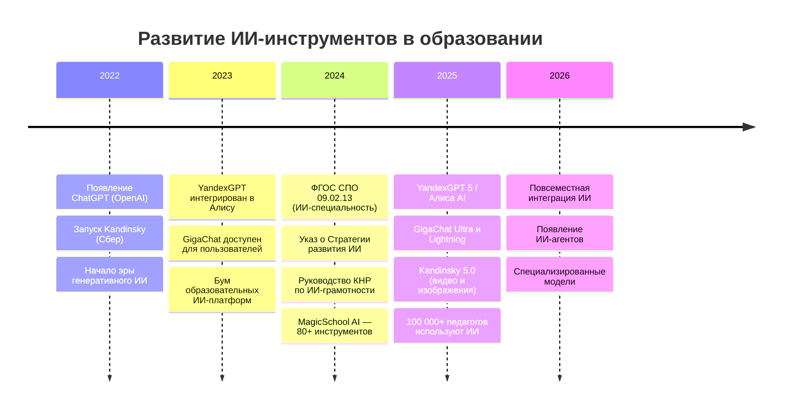

---

# ЧАСТЬ I. ТЕОРЕТИЧЕСКИЕ ОСНОВЫ

## § 1. Понятие искусственного интеллекта и его инструментов

### 1.1. Определение ключевых понятий

**Искусственный интеллект (ИИ)** — направление информатики, занимающееся разработкой систем, способных решать задачи, традиционно требующие человеческого мышления: анализировать информацию, находить закономерности, делать прогнозы и генерировать новое содержание — тексты, изображения, звуковые файлы.

**Нейросеть (нейронная сеть)** — особый тип алгоритма, архитектура которого вдохновлена строением человеческого мозга. Нейросеть состоит из «слоёв» узлов, которые передают и преобразуют данные, обучаясь на примерах. Именно нейросети лежат в основе большинства современных ИИ-инструментов.

*Рисунок. Архитектура многослойной нейронной сети (Wikimedia Commons, CC BY-SA)*

**Генеративный искусственный интеллект** — класс систем ИИ, способных создавать принципиально новый контент: тексты, изображения, звук, программный код. В отличие от аналитического ИИ, который классифицирует и обрабатывает существующие данные, генеративный ИИ созидает.

**Большая языковая модель (LLM, Large Language Model)** — тип программы искусственного интеллекта, обученной на огромных массивах текстовых данных и способной понимать, анализировать и генерировать человеческую речь. К таким моделям относятся YandexGPT, GigaChat, ChatGPT и другие.

**Инструменты ИИ** — программные приложения, использующие алгоритмы искусственного интеллекта для выполнения практических задач: генерации текстов, создания изображений, распознавания и синтеза речи, автоматизации рутинных операций.

### 1.2. Классификация инструментов искусственного интеллекта

Современные инструменты ИИ целесообразно классифицировать по нескольким основаниям.

**Схема 1. Классификация ИИ-инструментов по типу решаемых задач**

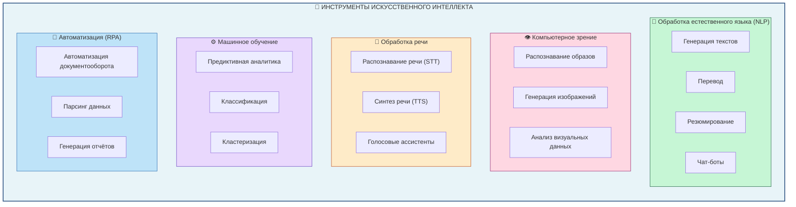

**По типу решаемых задач:**

1. **Инструменты обработки естественного языка (NLP)** — понимание, анализ и генерация текста на естественных языках. Применяются для создания чат-ботов, перевода, резюмирования документов, генерации учебных материалов.

2. **Инструменты компьютерного зрения** — интерпретация визуальных данных: распознавание образов, анализ изображений, создание графического контента.

3. **Инструменты обработки речи** — распознавание устной речи и её преобразование в текст, а также синтез речи из текстового источника.

4. **Платформы машинного обучения** — инфраструктура для создания, обучения и применения моделей машинного обучения.

5. **Инструменты автоматизации процессов (RPA)** — автоматизация рутинных цифровых операций.

**По функциональным группам применительно к образованию:**

| Группа | Назначение | Примеры инструментов |
|--------|------------|----------------------|
| Работа с текстом | Генерация, анализ, редактирование текстов | YandexGPT, GigaChat, ChatGPT |
| Работа с изображениями | Создание иллюстраций и наглядных пособий | Kandinsky, Midjourney |
| Работа со звуком | Транскрибирование, синтез речи | SaluteSpeech, Whisper |
| Создание презентаций | Автоматизация разработки слайдов | Gamma.app, Slider AI |
| Педагогические инструменты | Планирование уроков, создание тестов | MagicSchool AI, EduAide.ai |

*Рисунок 2. Классификация инструментов искусственного интеллекта для педагогической деятельности*

---

# ЧАСТЬ II. ОТЕЧЕСТВЕННЫЕ ИНСТРУМЕНТЫ ИСКУССТВЕННОГО ИНТЕЛЛЕКТА

Особое внимание в нашем курсе уделяется отечественным разработкам в области искусственного интеллекта. Российские ИИ-инструменты обладают рядом неоспоримых преимуществ: глубокой адаптацией к русскому языку, соответствием требованиям Федерального закона № 152-ФЗ «О персональных данных», включением в Реестр отечественного программного обеспечения Минцифры России, а также простотой интеграции с российскими информационными системами.

*Рисунок 3. Экосистема отечественных ИИ-инструментов для сферы образования и науки*

**Схема 2. Экосистема отечественных ИИ-инструментов для образования**

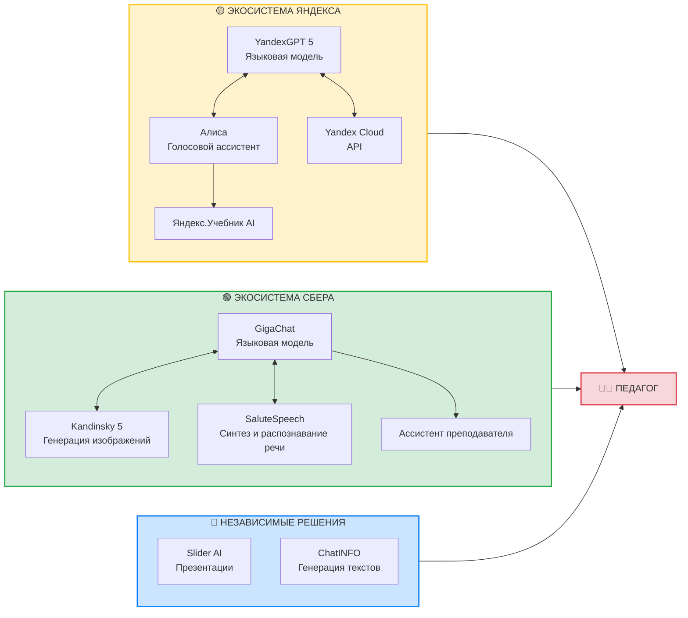

## § 2. YandexGPT — отечественная языковая модель (замена OpenAI ChatGPT?)

*Фото: Современный интерфейс взаимодействия с языковой моделью (Unsplash)*

### 2.1. Общая характеристика

**YandexGPT** (в конце 2025 года переименован в **Алиса AI**) — языковая нейросеть, разработанная компанией «Яндекс». Это российский аналог ChatGPT, обученный преимущественно на русскоязычных данных и оптимизированный для понимания особенностей русского языка.

YandexGPT понимает русский язык не через переводы, а «изнутри» — с интонациями, культурными нюансами и логикой речи. Модель глубоко интегрирована в экосистему сервисов Яндекса: голосовой ассистент Алиса, Яндекс.Поиск, Яндекс.Браузер, умный дом и многие другие.

Актуальная версия **YandexGPT 5.1 Pro** предлагает:
- Режим проверки фактов
- Генерацию изображений совместно с нейросетью Kandinsky
- Доступ через API для разработчиков
- Контекстное окно 128 тысяч токенов

### 2.2. Способы доступа к YandexGPT

Для педагогов доступны следующие способы работы с YandexGPT:

1. **Голосовой ассистент Алиса** — встроен в Яндекс.Браузер, мобильные приложения, умные колонки
2. **Яндекс.Поиск** — нейросеть интегрирована в поисковую выдачу
3. **Отдельный веб-интерфейс** — ya.ru/chat или 300.ya.ru
4. **Яндекс.Учебник AI** — специализированный инструмент для педагогов
5. **API Yandex Cloud** — для программной интеграции

### 2.3. Возможности YandexGPT для педагога

YandexGPT успешно решает следующие **ежедневные и периодические задачи учителя**:

**Ежедневные задачи:**
- Генерация конспектов уроков и методических указаний
- Создание вопросов для устного опроса
- Подготовка формулировок заданий
- Объяснение сложных тем простым языком
- Проверка и редактирование текстов

**Периодические задачи:**
- Разработка тестовых заданий и контрольных работ
- Составление календарно-тематического планирования
- Подготовка отчётной документации
- Создание дифференцированных заданий для учащихся разного уровня
- Генерация идей для проектной деятельности

**Пример использования:**

*Запрос педагога:* «Составь 10 вопросов для устного опроса по теме "Алгоритмы и исполнители" для 8 класса, включая вопросы на понимание, применение и анализ.»

YandexGPT сгенерирует структурированный список вопросов различного уровня сложности, который педагог может использовать как основу, адаптируя под конкретный класс.

### 2.4. Тарифы и условия использования

- **Бесплатный доступ** через Алису и Яндекс.Поиск
- **Подписка Яндекс.Плюс** — расширенные возможности
- **API** — тарификация по объёму обрабатываемых токенов

---

## § 3. GigaChat — мультимодальная модель от Сбера (наиболее продвинутая линейка GPT-подобных моделей)

### 3.1. Общая характеристика

**GigaChat** — большая языковая модель, разработанная компанией «Сбер». Это мультимодальная система, способная работать с текстом, кодом и изображениями.

Ключевые особенности GigaChat:
- **Мультимодальность** — работа с различными типами данных
- **Безопасность** — фокус на корпоративный сектор и соответствие российскому законодательству
- **Функция Deep Research** — глубокий анализ информации по заданной теме
- **Бесплатный доступ** — большинство функций доступно после регистрации
- **Интеграция через API** — для разработчиков и корпоративных пользователей

Актуальная версия **GigaChat 3 Pro** предлагает контекстное окно в **200 тысяч токенов**, что позволяет анализировать объёмные документы целиком.

### 3.2. GigaChat для педагога

«Сбер» активно развивает направление образовательных сервисов на базе GigaChat:

**«Ассистент преподавателя» от СберОбразования** — специализированный ИИ-инструмент для педагогов, который:
- Анализирует уроки по 16 метрикам (баланс речи, эмоциональная модальность, методические приёмы)
- Формирует конспекты и стенограммы занятий
- Даёт рекомендации по улучшению педагогической практики
- Создаёт викторины и задания

К концу 2025 года этот сервис использовали более **100 000 педагогов** по всей России.

**Образовательные задачи, решаемые с помощью GigaChat:**

| Тип задачи | Описание | Пример применения |
|------------|----------|-------------------|
| Генерация контента | Создание учебных текстов | Конспект лекции по заданной теме |
| Анализ документов | Обработка нормативных актов | Выделение ключевых положений ФГОС |
| Структурирование | Организация информации | Создание таблиц, схем, планов |
| Код и данные | Работа с программированием | Объяснение алгоритмов, проверка кода |
| Визуализация | Генерация изображений | Иллюстрации через встроенный Kandinsky |

### 3.3. Курс по работе с GigaChat

СберУниверситет предлагает **бесплатный курс по промпт-инженерингу** для работы с GigaChat, включающий:
- Знакомство с большими языковыми моделями
- Основы промпт-инженеринга
- Методы промптинга
- Генерация изображений в Kandinsky
- Кейсы применения в науке, маркетинге, творческих задачах

**Доступ:** courses.sberuniversity.ru/llm-gigachat

### 3.4. Практические рекомендации

При работе с GigaChat педагогу рекомендуется:

1. **Формулировать чёткие запросы** — указывать контекст, целевую аудиторию, желаемый формат
2. **Использовать системные промпты** — задавать роль ассистента (например, «Ты — опытный методист»)
3. **Проверять результаты** — ИИ может допускать фактические ошибки
4. **Итерировать** — уточнять и дополнять запросы для улучшения результата

---

## § 4. Kandinsky — генерация изображений

*Фото: Визуализация технологий искусственного интеллекта (Pexels)*

### 4.1. Общая характеристика

**Kandinsky** — нейросеть для генерации изображений по текстовому описанию, разработанная компанией «Сбер». Названа в честь выдающегося русского художника Василия Кандинского, основоположника абстракционизма.

Актуальная версия **Kandinsky 4.1 Image** (2025) представляет собой диффузионный трансформер (DiT) вместо архитектуры U-Net, что обеспечивает значительно улучшенное качество генерации.

Ключевые возможности:
- Генерация изображений по текстовому описанию на русском и английском языках
- **Генерация надписей на кириллице** — уникальная функция, появившаяся в 2025 году
- Редактирование существующих изображений
- Перенос стиля
- Разрешение до 4K

### 4.2. Образовательное применение Kandinsky

**Задачи, решаемые с помощью Kandinsky:**

1. **Создание иллюстраций к учебным материалам**
   - Наглядные пособия по истории, биологии, географии
   - Визуализация абстрактных понятий
   - Иллюстрации к литературным произведениям

2. **Разработка дидактических материалов**
   - Карточки для игровых форм обучения
   - Пиктограммы и схемы
   - Обложки для проектов и докладов

3. **Оформление презентаций**
   - Уникальные фоновые изображения
   - Тематические иллюстрации

4. **Творческие проекты учащихся**
   - Визуализация идей
   - Создание персонажей и сцен

**Пример промпта:**

«*Учитель информатики объясняет алгоритм школьникам у доски, светлый класс, современное оборудование, дружелюбная атмосфера, иллюстрация в стиле учебника*»

### 4.3. Доступ к Kandinsky

- **GigaChat** — встроенная генерация изображений
- **Отдельное веб-приложение** — fusionbrain.ai
- **Телеграм-бот** — @kandaborbot
- **API** — для разработчиков

---

## § 5. SaluteSpeech — технологии работы с речью

### 5.1. Общая характеристика

**SaluteSpeech** — технология синтеза и распознавания речи от компании «Сбер», оптимизированная для русского языка.

Ключевые возможности:
- **Speech-to-Text (STT)** — распознавание речи и преобразование в текст
- **Text-to-Speech (TTS)** — синтез речи из текста
- **Анализ эмоций** — определение эмоциональной окраски голоса
- **SaluteSpeech VoiceCloning** — создание голосовых моделей на основе нескольких секунд записи

### 5.2. Образовательное применение

**Ежедневные задачи:**
- Транскрибирование лекций и вебинаров
- Создание текстовых версий устных ответов учащихся
- Голосовой ввод текста при подготовке материалов

**Периодические задачи:**
- Озвучивание учебных материалов для инклюзивного образования
- Создание аудиоверсий конспектов и инструкций
- Подготовка материалов для учащихся с нарушениями зрения

**Практический пример:**

Педагог записывает устное объяснение сложной темы на диктофон. SaluteSpeech автоматически транскрибирует запись в текст, который можно отредактировать и использовать как методическую разработку или раздаточный материал для учащихся.

---

## § 6. Дополнительные отечественные инструменты

### 6.1. Slider AI — автоматизация презентаций

**Slider AI** — российская платформа для автоматизированного создания презентаций на основе текстового описания.

Возможности:
- Генерация слайдов по текстовому запросу
- Создание инфографики и бизнес-диаграмм
- Интеграция с системами аналитики
- Аналитика просмотров презентаций

### 6.2. ChatINFO

**ChatINFO** — российский ИИ-сервис, ориентированный на образовательную аудиторию.

Функции:
- Создание рефератов и статей
- Проверка уникальности текста
- Исправление грамматических и стилистических ошибок
- Подготовка научных материалов

### 6.3. Диалоговые тренажёры Президентской академии

Уникальная разработка РАНХиГС для студентов социо-гуманитарных направлений:
- Моделирование профессиональных ситуаций
- Персонализированные рекомендации
- Развитие навыков коммуникации

---

# КРИТИЧЕСКИЙ АНАЛИЗ ОТЕЧЕСТВЕННЫХ ИИ-ИНСТРУМЕНТОВ

## § 7. Объективная оценка возможностей и ограничений

> *«Наши российские LLM словно отстают на 1, а то и 2 поколения от зарубежных аналогов.»*
> — Habr, декабрь 2025

Важно помнить! Научный подход требует критического анализа любых инструментов, в том числе отечественных разработок. Честная оценка позволит правильно выбирать инструменты для конкретных задач.

### 7.1. Критический анализ YandexGPT

**Положительные стороны:**
- Глубокое понимание русского языка и культурного контекста
- Интеграция в экосистему Яндекса
- Соответствие российскому законодательству
- Бесплатный базовый доступ через Алису

**Существенные ограничения (по данным пользовательских отзывов и экспертных оценок):**

1. **Ограниченные интеллектуальные возможности**
   - По отзывам профессиональных пользователей, модель «даёт очень примитивные ответы»
   - Не справляется со сложными аналитическими задачами
   - **Вывод:** подходит для начального и среднего образования, но **недостаточна для высшего образования и научной работы**

2. **Технологическое отставание**
   - По оценкам экспертов Habr, российские LLM отстают на 1-2 поколения от GPT-4, Claude, Gemini
   - Ограниченный контекст (до 128K токенов vs 200K+ у конкурентов)
   - Менее развитые способности к рассуждению (reasoning)

3. **Проблемы с генерацией изображений**
   - Пользователи отмечают «очень низкий уровень модели генерации картинок»
   - Модель плохо знает российские достопримечательности (хуже зарубежных аналогов)

4. **Проблемы после интеграции с Алисой**
   - Отзывы: «Алиса после присоединения [к GPT-моделям] стала намного тупее»

**Рекомендации для педагога:**
- Использовать YandexGPT для **базовых задач**: генерация простых текстов, черновики, идеи
- Для сложных академических задач — **комбинировать с другими инструментами**
- **Обязательно проверять** фактическую информацию

*Рисунок 5. Сравнительный анализ языковых моделей для образовательных задач*

### 7.2. Критический анализ Яндекс.Учебника

**Положительные стороны:**
- Бесплатная платформа для учителей
- Готовые задания по ФГОС
- Автоматическая проверка ответов
- Аналитика успеваемости

**Существенные ограничения:**

1. **Фактически архитектурно ограниченный охват предметов и классов**
   - Русский язык: 1-6 классы
   - Математика: 1-6 классы
   - Информатика: 7-9 классы
   - **Нет поддержки старших классов (10-11) и высшего образования**

2. **Примитивный интерфейс и функционал**
   - Невозможность создания сложных межпредметных связей
   - Ограниченная кастомизация заданий
   - Нет инструментов для построения концептуальных карт

3. **Ориентация на начальную школу**
   - Платформа оптимизирована для детей, не для взрослых учащихся
   - Не подходит для СПО, вузов, дополнительного профессионального образования

**Рекомендации:**
- Яндекс.Учебник — хороший инструмент **только для начальной и средней школы**
- Для колледжей и вузов — использовать более продвинутые платформы

### 7.3. Критический анализ GigaChat

**Положительные стороны:**
- Мультимодальность (текст, код, изображения)
- Большое контекстное окно (200K токенов)
- Функция Deep Research
- Бесплатный доступ
- Хорошие платные модели по сравнению с YandexGPT

**Существенные ограничения (по данным пользовательских отзывов):**

1. **Математические вычисления**
   - «Не может решить уравнение через дискриминант»
   - «Указываешь на ошибку, а он отпирается и снова говорит неправильный ответ»

2. **Работа с кодом**
   - Ограничение ~50 строк кода за раз (возможно стало лучше)
   - Бывает, что делает «тексты уровня 3-х летнего ребёнка»
   - Не подходит для серьёзных программных проектовиз коробки
   - В сочетании с дополнительными программными разработками (например на Pyhton) и подходами может сносно работать.

*Фото: Обучение программированию в современных условиях (Pexels)*

3. **Проблемы с промптами**
   - Иногда пишут что-то вроде «абсолютно не понимает промтов, загибает под своё»
   - Русские надписи на изображениях генерирует с ошибками

4. **Сложная авторизация**
   - Требует Сбер ID - авторизация через приложение банка
   - «Авторизуетесь, как будто подаёте заявку на ипотеку»

**Сравнение с мировыми аналогами:**

| Параметр | GigaChat | ChatGPT-4 | Claude 3.5 |
|----------|----------|-----------|------------|
| Контекст | 200K | 128K | 200K |
| Русский язык | ★★★★☆ | ★★★☆☆ | ★★★☆☆ |
| Рассуждения | ★★☆☆☆ | ★★★★★ | ★★★★★ |
| Код | ★★☆☆☆ | ★★★★★ | ★★★★☆ |
| Математика | ★★☆☆☆ | ★★★★☆ | ★★★★☆ |
| Доступность в РФ | ★★★★★ | ★☆☆☆☆ | ★★☆☆☆ |

### 7.4. Критический анализ образовательной платформы Сбера

**«AI-помощник для вузов»** — проект Сбера для высшего образования.

**Положительные стороны:**
- Интеграция с сайтами вузов
- Ответы в реальном времени
- Поддержка абитуриентов и студентов

**Существенные ограничения:**

1. **Недостаточная адаптивность**
   - Платформа не адаптируется под индивидуальный уровень студента
   - Нет персонализированных траекторий обучения
   - Отсутствует интеллектуальное тьюторство

2. **Ограниченная интеграция**
   - Работает преимущественно с информацией сайтов вузов
   - Не интегрирован с LMS (Moodle, Canvas и др.)

3. **Базовый функционал**
   - В основном отвечает на FAQ-вопросы
   - Не поддерживает сложные образовательные сценарии

### 7.5. Выводы критического анализа

**Общая проблема российских ИИ-инструментов:**

Как отмечают эксперты Habr (декабрь 2025): «В 2022 году Яндекс и Сбер работали над LLM, но обучали их под конкретные специфические задачи. Концепция универсальной LLM казалась неправильным направлением. Это был стратегический выбор — и, к сожалению, он оказался ошибочным, создав технологический разрыв минимум на год.»

**Практические неформальные рекомендации для педагогов высшего и среднего профессионального образования:**

1. **Для сложных интеллектуальных задач** — использовать ChatGPT, Claude (через VPN), GigaChat
2. **Для работы с русским языком и базовых задач** — GigaChat, YandexGPT
3. **Для генерации изображений** — Kandinsky (хорош для базовых задач), Midjourney (для качественных), Шедеврум (развлечения, контент для детей)
4. **Для конфиденциальных данных** — только отечественные решения

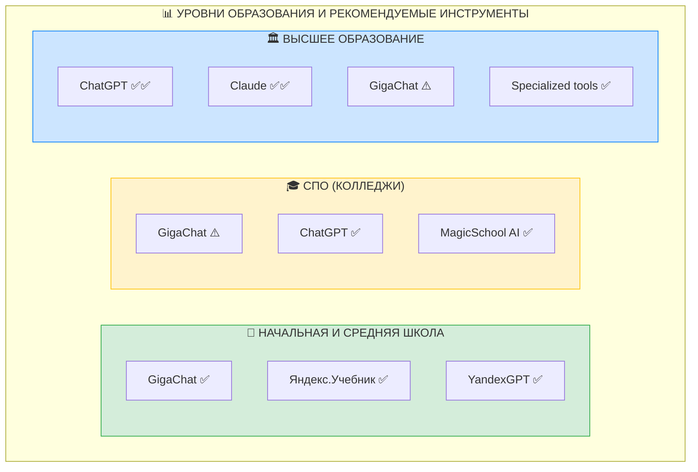

---

# ЧАСТЬ III. ЗАРУБЕЖНЫЕ ИНСТРУМЕНТЫ ИСКУССТВЕННОГО ИНТЕЛЛЕКТА

*Фото: Символ современных технологий искусственного интеллекта (Pexels)*

Наряду с отечественными разработками педагогу следует знать и о зарубежных ИИ-инструментах, которые в ряде случаев могут дополнять российские решения.

## § 7. ChatGPT — глобальный стандарт языковых моделей

### 7.1. Общая характеристика

**ChatGPT** — языковая модель от компании OpenAI (США), ставшая символом современного генеративного ИИ.

Особенности:
- Широчайшие возможности генерации текстов
- Способность писать и объяснять программный код
- Анализ данных (функция Advanced Data Analysis)
- Огромная база знаний

**Ограничения для российских пользователей:**
- Требуется VPN для доступа к оригинальному сервису
- Для регистрации необходим зарубежный мобильный номер
- Платная подписка для доступа к актуальным версиям модели

### 7.2. Принципиальное замечание

Как отмечается в справочных материалах, ChatGPT «ведёт себя как ассистент, который очень хочет понравиться руководству: если не знает чего-то, может начать придумывать». Это явление называется **«галлюцинациями»** ИИ.

**Правило педагога:** Любую информацию, полученную от ChatGPT (как и от других ИИ), необходимо **обязательно проверять** по достоверным источникам.

---

## § 8. MagicSchool AI — специализированный инструмент для педагогов

### 8.1. Общая характеристика

**MagicSchool AI** — американская платформа, разработанная специально для учителей и предлагающая более **80 инструментов** для педагогической деятельности.

### 8.2. Ключевые инструменты

| Инструмент | Назначение |
|------------|------------|
| Lesson Plan Generator | Генерация планов уроков |
| Academic Content | Создание учебных текстов |
| Quiz Generator | Генерация тестов и викторин |
| Rubric Generator | Создание критериев оценивания |
| 5E Model Science Lesson Plan | Планирование уроков естественных наук по модели 5E |
| IEP Goal Generator | Генерация целей индивидуальных образовательных программ |

### 8.3. Особенности

- Понимание педагогических принципов
- Соответствие образовательным стандартам (американским)
- Специализация на школьном образовании K-12
- **Ограничение:** интерфейс и основной функционал на английском языке

---

## § 9. Gamma.app — ИИ для создания презентаций

### 9.1. Общая характеристика

**Gamma.app** — платформа для создания презентаций, документов и веб-страниц с использованием генеративного ИИ.

По состоянию на 2025 год с помощью Gamma создано более **250 миллионов** презентаций, веб-сайтов и документов.

### 9.2. Возможности для педагога

- **Генерация презентаций по текстовому описанию** — достаточно описать идею, и ИИ создаст структурированную презентацию
- **Автоматический дизайн** — подбор цветовых схем, шрифтов, размещение контента
- **Адаптивность** — автоматическая оптимизация под разные устройства
- **Экспорт** — возможность экспорта в PowerPoint, Google Slides и другие форматы
- **Интерактивные элементы** — встраивание видео, карт, диаграмм

### 9.3. Образовательное применение

**Ежедневные задачи:**
- Быстрая подготовка наглядных материалов к уроку
- Создание опорных схем и карточек

**Периодические задачи:**
- Разработка презентаций для педагогических советов
- Подготовка материалов для родительских собраний
- Оформление проектов и отчётов

### 9.4. Условия использования

- **Бесплатный тариф** — базовые функции, водяной знак
- **Платная подписка** — расширенные возможности
- **Не требует VPN** для доступа из России
- **Русский язык** — полная поддержка интерфейса и генерации

---

## § 10. ChatPDF — анализ документов

### 10.1. Общая характеристика

**ChatPDF** — сервис для анализа PDF-документов с использованием технологий ChatGPT.

Ключевые особенности:
- Не требует регистрации
- Работает без VPN
- Полностью бесплатен
- Позволяет «общаться» с документом — задавать вопросы и получать ответы на основе его содержания

### 10.2. Образовательное применение

- **Резюмирование научных статей и докладов**, особенно на иностранных языках
- **Извлечение ключевых тезисов** из объёмных документов
- **Подготовка аннотаций** к методическим материалам
- **Анализ нормативных документов** — ФГОС, примерных программ

**Практический пример:**

Педагог загружает PDF-файл с научной статьёй на английском языке по теме «Применение ИИ в профессиональном образовании». Запрос: «Напиши 10 ключевых тезисов на русском языке с примерами из текста». ChatPDF анализирует документ и выдаёт структурированный конспект.

---

## § 11. Whisper — транскрибирование аудио

### 11.1. Общая характеристика

**Whisper** — нейросеть для распознавания речи от OpenAI.

**Whisper JAX** — бесплатная надстройка, работающая значительно быстрее оригинала.

Возможности:
- Расшифровка аудиозаписей на разных языках, включая русский
- Высокая скорость: 1,5-часовое интервью — за 2-3 минуты
- Не требует регистрации и VPN

### 11.2. Образовательное применение

- Создание текстовых версий видеолекций
- Расшифровка записей конференций и вебинаров
- Стенограммы педагогических совещаний
- Документирование устных ответов учащихся

---

## § 12. Claude — альтернативная языковая модель

*Логотип компании Anthropic — разработчика Claude AI (Wikimedia Commons)*

### 12.1. Общая характеристика

**Claude** — языковая модель от компании Anthropic (США), позиционируется как более безопасная и «этичная» альтернатива ChatGPT.

**Ключевые преимущества Claude для образования:**

1. **Превосходное качество длинных текстов**
   - Более связные и структурированные ответы
   - Лучше сохраняет контекст в длинных диалогах
   - Идеален для написания академических текстов

2. **Контекстное окно 200K токенов**
   - Возможность анализа целых книг и больших документов

3. **Более «человечные» ответы**
   - Менее «механический» стиль
   - Лучше понимает нюансы

4. **Сильные аналитические способности**
   - Глубокий анализ текстов
   - Качественная работа с научными материалами

**Ограничения:**
- Требует VPN для доступа из России
- Платная подписка для полного функционала
- Медленнее ChatGPT в генерации

### 12.2. Сравнение LLM для образовательных задач

| Критерий | ChatGPT-4 | Claude 3.5 | GigaChat | YandexGPT |
|----------|-----------|------------|----------|-----------|
| **Скорость** | ★★★★★ | ★★★☆☆ | ★★★★☆ | ★★★★☆ |
| **Качество текстов** | ★★★★☆ | ★★★★★ | ★★★☆☆ | ★★★☆☆ |
| **Русский язык** | ★★★☆☆ | ★★★☆☆ | ★★★★★ | ★★★★★ |
| **Код** | ★★★★★ | ★★★★☆ | ★★☆☆☆ | ★★☆☆☆ |
| **Рассуждения** | ★★★★★ | ★★★★★ | ★★☆☆☆ | ★★☆☆☆ |
| **Доступность в РФ** | ★☆☆☆☆ | ★★☆☆☆ | ★★★★★ | ★★★★★ |
| **Цена** | $20/мес | $20/мес | Бесплатно | Бесплатно |
| **Для высшего образования** | ✅✅ | ✅✅ | ⚠️ | ⚠️ |
| **Для школы** | ✅ | ✅ | ✅✅ | ✅✅ |

---

# ЧАСТЬ IV. СПЕЦИАЛИЗИРОВАННЫЕ ОБРАЗОВАТЕЛЬНЫЕ ИИ-ИНСТРУМЕНТЫ

*Фото: Современный учебный класс с интеграцией цифровых технологий (Unsplash)*

Помимо универсальных языковых моделей, существует целый класс **специализированных инструментов**, разработанных именно для педагогов. Эти платформы понимают образовательный контекст и предлагают готовые решения для типичных задач учителя.

## § 13. MagicSchool AI — комплексная платформа для педагогов

### 13.1. Общая характеристика

**MagicSchool AI** (magicschool.ai) — американская платформа, предлагающая **более 80 специализированных ИИ-инструментов** для учителей.

По данным RAND Survey (2025), около **53% учителей** в США используют ИИ для школьных задач, и MagicSchool AI является одним из лидеров рынка.

### 13.2. Ключевые инструменты MagicSchool AI

**Планирование уроков:**
| Инструмент | Назначение |
|------------|------------|
| Lesson Plan Generator | Полные планы уроков по стандартам |
| 5E Model Science Lesson Plan | Уроки по модели 5E для естественных наук |
| Unit Plan Generator | Планирование целых разделов/модулей |
| Scope & Sequence | Календарно-тематическое планирование |

**Создание контента:**
| Инструмент | Назначение |
|------------|------------|
| Academic Content | Учебные тексты любого уровня сложности |
| YouTube Video Questions | Вопросы к видеоурокам |
| Text Rewriter | Адаптация текстов под разные уровни |
| Vocabulary List | Генерация словарных списков |

**Оценивание:**
| Инструмент | Назначение |
|------------|------------|
| Quiz Generator | Тесты и викторины |
| Rubric Generator | Критерии оценивания |
| Multiple Choice Assessments | Тесты с вариантами ответов |
| IEP Goal Generator | Цели индивидуальных программ |

**Коммуникация:**
| Инструмент | Назначение |
|------------|------------|
| Email Responder | Ответы на письма родителей |
| Newsletter Generator | Школьные новостные рассылки |
| Report Card Comments | Комментарии к табелям |

### 13.3. Особенности для практического применения

**Преимущества:**
- Понимание педагогической терминологии
- Соответствие образовательным стандартам (американским)
- Интуитивный интерфейс
- Бесплатный базовый тариф

**Ограничения для российских педагогов:**
- Интерфейс только на английском языке
- Ориентация на американские стандарты (Common Core)
- Требует адаптации под ФГОС

---

## § 14. Curipod — интерактивные уроки

### 14.1. Общая характеристика

**Curipod** (curipod.com) — платформа для создания интерактивных уроков с использованием ИИ.

**Ключевые возможности:**
- Генерация интерактивных слайдов по теме урока
- Встроенные опросы и викторины в реальном времени
- Элементы геймификации
- Аналитика вовлечённости учащихся

### 14.2. Применение в образовании

**Сценарии использования:**
1. Создание вовлекающих презентаций за минуты
2. Проведение мозговых штурмов в классе
3. Формирующее оценивание в реальном времени
4. Рефлексия в конце урока

---

## § 15. Diffit — дифференциация обучения

*Фото: Современные технологии в образовании (Pexels)*

### 15.1. Общая характеристика

**Diffit** (diffit.me) — ИИ-инструмент для автоматической дифференциации учебных материалов.

**Ключевая функция:** адаптация текстов под разные уровни читательской компетенции (Lexile levels).

### 15.2. Практическое применение

**Возможности:**
- Загрузка любого текста или URL
- Автоматическое упрощение или усложнение
- Генерация вопросов к тексту
- Создание словарных списков
- Перевод на другие языки с сохранением адаптации

**Пример использования:**
Педагог загружает научную статью о нейросетях. Diffit создаёт:
- Версию для продвинутых учащихся (оригинальная сложность)
- Версию для среднего уровня (упрощённая лексика)
- Версию для начинающих (базовая лексика + иллюстрации)
- Вопросы для проверки понимания для каждого уровня

---

## § 16. EduAide.ai — ассистент педагога

### 16.1. Общая характеристика

**EduAide.ai** (eduaide.ai) — комплексный ИИ-ассистент для учителей с широким набором функций.

### 16.2. Ключевые возможности

**Генератор ресурсов:**
- Планы уроков с учётом таксономии Блума
- Дифференцированные задания
- Формативные и суммативные оценки
- Рабочие листы и карточки

**Обратная связь:**
- Автоматические комментарии к работам учащихся
- Конструктивная критика в педагогическом стиле
- Рекомендации по улучшению

**Особенность:** EduAide позиционируется как инструмент с учётом педагогических принципов, а не просто генератор текстов.

---

## § 17. Gradescope — автоматизация оценивания

### 17.1. Общая характеристика

**Gradescope** (gradescope.com) — платформа для автоматизации проверки и оценивания работ, популярная в высшем образовании.

### 17.2. Ключевые функции

**Автоматическое оценивание:**
- Тесты с множественным выбором
- Задания по программированию
- Математические выражения
- Бланки для сканирования

**ИИ-ассистирование:**
- Группировка похожих ответов
- Обнаружение паттернов в ошибках
- Ускорение проверки эссе

**Применение:** идеально для **преподавателей вузов и колледжей** с большими потоками студентов.

---

## § 18. Edcafe — быстрое создание уроков

### 18.1. Общая характеристика

**Edcafe** (edcafe.ai) — один из самых быстрых инструментов для создания полных уроков по описанию.

### 18.2. Процесс работы

1. Ввод темы, класса и целей
2. ИИ генерирует структуру урока
3. Автоматическое наполнение контентом
4. Редактирование и кастомизация
5. Экспорт в различные форматы

**Преимущество:** скорость — полный урок за 2-3 минуты.

---

## § 19. Chalkie AI — конструктор уроков

### 19.1. Общая характеристика

**Chalkie AI** (chalkie.ai) — ИИ-конструктор уроков с фокусом на визуальные материалы.

### 19.2. Возможности

- Генерация слайдов с фактами, изображениями и видео
- Встроенные викторины
- Адаптация под любой возраст (K-12, взрослые)
- Редактируемые шаблоны

**Особенность:** каждый слайд содержит не только текст, но и медиаконтент.

---

## § 20. SchoolAI — пространства для учащихся

### 20.1. Общая характеристика

**SchoolAI** (schoolai.com) — платформа, позволяющая создавать безопасные ИИ-пространства для учащихся.

### 20.2. Ключевые функции

**Spaces (Пространства):**
- Настраиваемые ИИ-ассистенты для конкретных тем
- Контроль над поведением ИИ со стороны учителя
- Мониторинг диалогов учащихся с ИИ
- Ограничения контента

**Применение:**
- Создание тематических ИИ-тьюторов
- Безопасное знакомство учащихся с ИИ
- Индивидуальная поддержка учащихся

---

## § 21. Sonix — профессиональная транскрибация

### 21.1. Общая характеристика

**Sonix** (sonix.ai) — профессиональный сервис транскрибации с поддержкой 49+ языков.

### 21.2. Преимущества для высшего образования

- Высокая точность для академического контента
- Автоматический перевод стенограмм
- Интеграция с системами управления обучением
- Субтитры для видеолекций

**Применение:** идеально для **профессоров и преподавателей вузов**, которые записывают лекции.

---

*Рисунок 6. Специализированные ИИ-инструменты для педагогов*

*Фото: Онлайн-обучение с применением современных технологий (Pexels)*

## § 22. Сводная таблица специализированных инструментов

| Инструмент | Основная функция | Для кого | Язык | Цена |
|------------|------------------|----------|------|------|
| **MagicSchool AI** | 80+ инструментов | K-12 | EN | Freemium |
| **Curipod** | Интерактивные уроки | K-12 | EN | Freemium |
| **Diffit** | Дифференциация | K-12 | EN | Freemium |
| **EduAide.ai** | Генерация ресурсов | K-12 | EN | Freemium |
| **Gradescope** | Автооценивание | Вузы | EN | Платно |
| **Edcafe** | Быстрые уроки | K-12 | EN | Freemium |
| **Chalkie AI** | Визуальные уроки | K-12 | EN | Freemium |
| **SchoolAI** | ИИ-пространства | K-12 | EN | Freemium |
| **Sonix** | Транскрибация | Вузы | 49+ | Платно |

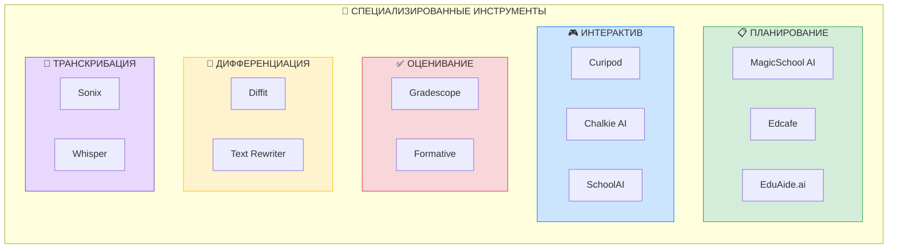

---

# ЧАСТЬ V. ГЛОБАЛЬНАЯ СТАТИСТИКА И ТЕНДЕНЦИИ

*Фото: Искусственный интеллект трансформирует образование (Pexels)*

## § 23. Статистика использования ИИ в образовании

*Рисунок 7. Глобальная статистика использования ИИ в образовании (2025)*

### 23.1. Мировые данные (2024-2025)

По данным Center for Democracy & Technology и RAND Corporation (2025):

**Использование ИИ учителями и учащимися:**
- **86% учащихся** используют ИИ в учебной деятельности
- **85% учителей** применяют ИИ для профессиональных задач
- **66% студентов** используют ChatGPT для образования
- **53% учителей** естественных наук, математики и языков используют ИИ

**Рост использования:**
- Рост на **15+ процентных пунктов** за 2024-2025 год
- **265% рост** самообучения при использовании Microsoft Copilot

**Проблемы:**
- **50% учащихся** чувствуют снижение связи с учителями при использовании ИИ
- **68% учителей** в городских школах не получили никакого обучения по ИИ
- **30% женщин** чувствуют себя перегруженными при работе с ИИ (vs 21% мужчин)

### 23.2. Прогнозы рынка

По данным Market.us и DemandSage (2025-2026):

- Глобальный рынок ИИ в образовании достигнет **$73,7 млрд к 2033 году**
- Рынок ИИ для студентов вырастет до **$112,3 млрд к 2034 году**

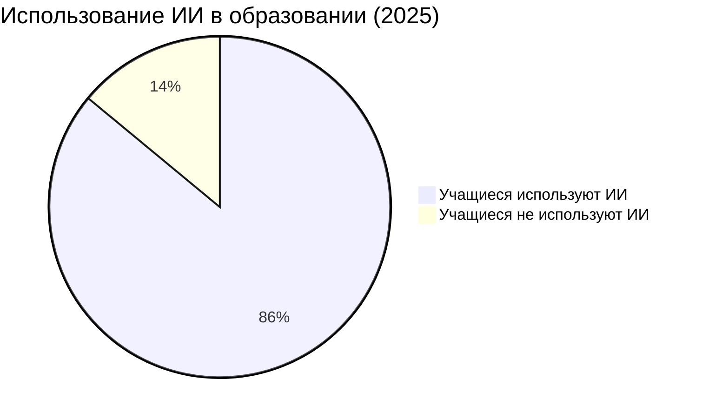

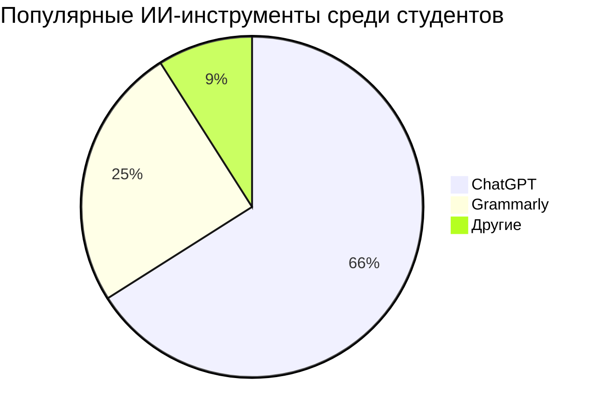

---

# ЧАСТЬ VI. ПРАКТИЧЕСКОЕ ПРИМЕНЕНИЕ ИИ-ИНСТРУМЕНТОВ В ПЕДАГОГИЧЕСКОЙ ДЕЯТЕЛЬНОСТИ

## § 24. Решение образовательных задач с помощью ИИ

### 24.1. Систематизация задач по типам

Рассмотрим, какие инструменты наиболее эффективны для решения типичных задач педагога.

**Схема 4. Образовательные задачи педагога и ИИ-инструменты для их решения**

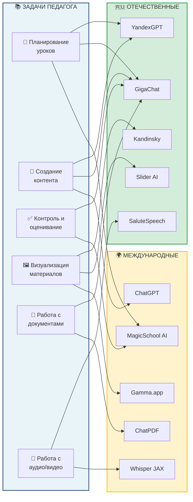

*Фото: Педагог использует цифровые инструменты для подготовки урока (Unsplash)*

#### Таблица 1. Соотнесение образовательных задач и ИИ-инструментов

| Категория задач | Конкретные задачи | Рекомендуемые инструменты |
|-----------------|-------------------|---------------------------|
| **Планирование** | Поурочные планы, КТП | YandexGPT, GigaChat, MagicSchool AI |
| **Создание контента** | Конспекты, методические материалы | YandexGPT, GigaChat |
| **Контроль и оценивание** | Тесты, контрольные работы, рубрики | GigaChat, MagicSchool AI |
| **Визуализация** | Презентации, наглядные пособия | Gamma.app, Slider AI, Kandinsky |
| **Работа с документами** | Анализ НПА, резюмирование | ChatPDF, GigaChat (Deep Research) |
| **Работа с аудио/видео** | Транскрибирование, озвучивание | SaluteSpeech, Whisper JAX |
| **Дифференциация** | Адаптация материалов | YandexGPT, GigaChat |
| **Обратная связь** | Комментарии к работам | GigaChat, EduAide.ai |

### 24.2. Алгоритм выбора инструмента

При выборе ИИ-инструмента педагогу следует руководствоваться следующим алгоритмом:

*Рисунок 4. Алгоритм работы педагога с инструментами искусственного интеллекта*

**Схема 3. Алгоритм выбора ИИ-инструмента педагогом**

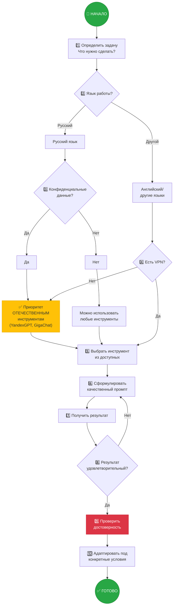

### 24.3. Примеры практического применения

**Пример 1. Подготовка урока информатики**

*Задача:* Разработать план урока по теме «Линейные алгоритмы» для 8 класса.

*Решение:*
1. Открыть GigaChat или YandexGPT
2. Промпт: «Составь подробный план урока информатики для 8 класса по теме "Линейные алгоритмы". Включи: цели урока, планируемые результаты, этапы урока с описанием деятельности учителя и учащихся, практическое задание, вопросы для рефлексии. Урок рассчитан на 45 минут.»
3. Проверить соответствие ФГОС
4. Адаптировать под конкретный класс

**Пример 2. Создание наглядного пособия**

*Задача:* Создать иллюстрацию для темы «Устройство компьютера».

*Решение:*
1. Открыть Kandinsky (через GigaChat или fusionbrain.ai)
2. Промпт: «Схематичное изображение внутреннего устройства персонального компьютера с подписями основных компонентов: процессор, оперативная память, видеокарта, жёсткий диск, материнская плата. Стиль технической иллюстрации для учебника.»
3. При необходимости уточнить запрос
4. Добавить подписи в графическом редакторе

**Пример 3. Транскрибирование вебинара**

*Задача:* Создать текстовую версию записи вебинара по повышению квалификации.

*Решение:*
1. Сохранить аудиодорожку вебинара
2. Загрузить в Whisper JAX (huggingface.co/spaces/sanchit-gandhi/whisper-jax)
3. Получить транскрипт
4. Отредактировать, устранить ошибки распознавания
5. Использовать как конспект или методический материал

---

## § 25. Принципы эффективного использования ИИ в образовании

### 25.1. Дидактические принципы

**Принцип педагогической целесообразности**

ИИ-инструменты должны использоваться не ради технологий, а для решения конкретных педагогических задач. Прежде чем применять ИИ, необходимо ответить на вопрос: «Какую образовательную проблему это поможет решить?»

**Принцип критического отношения к результатам**

Генеративный ИИ не застрахован от ошибок. Все результаты работы нейросетей требуют проверки и экспертной оценки педагога. ИИ — помощник, но ответственность за качество образования несёт учитель.

**Принцип этичности и прозрачности**

Использование ИИ в образовательном процессе должно быть открытым. Учащиеся должны знать, когда материалы подготовлены с использованием ИИ. Важно формировать у молодёжи культуру ответственного использования технологий.

**Принцип комплементарности**

ИИ дополняет, но не заменяет профессиональные компетенции педагога. Творческие, воспитательные, эмоционально-ценностные аспекты педагогической деятельности остаются прерогативой человека.

### 25.2. Формирование промптов

**Промпт (prompt)** — текстовый запрос, который пользователь направляет языковой модели. От качества промпта напрямую зависит качество результата.

**Схема 5. Структура эффективного промпта**

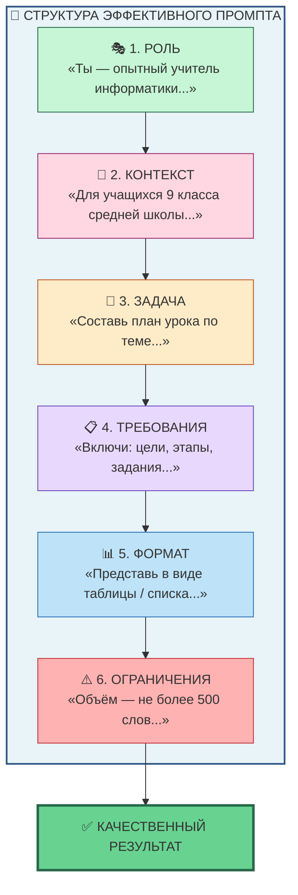

**Пример:**

«*Ты — опытный методист по информатике. Для учащихся 10 класса профильного уровня составь 5 задач по теме "Логические операции" разного уровня сложности: 2 базовых, 2 повышенных, 1 олимпиадного. Для каждой задачи приведи решение. Представь в виде нумерованного списка.*»

---

## § 26. Риски и ограничения применения ИИ

**Схема 6. Риски применения ИИ в образовании и меры их минимизации**

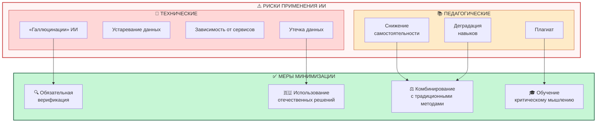

### 26.1. Технические риски

1. **«Галлюцинации» ИИ** — генерация правдоподобной, но недостоверной информации
2. **Устаревание данных** — модели обучены на данных до определённой даты
3. **Зависимость от сервисов** — сбои, изменение условий доступа
4. **Проблемы конфиденциальности** — данные могут использоваться для обучения моделей

### 26.2. Педагогические риски

1. **Снижение самостоятельности мышления** — учащиеся могут привыкнуть получать готовые ответы
2. **Плагиат** — использование ИИ-генерированных текстов без переработки
3. **Деградация профессиональных навыков** — утрата способности делать работу без ИИ

### 26.3. Меры минимизации рисков

- **Обязательная верификация** любой информации от ИИ
- **Комбинирование** ИИ-методов с традиционными
- **Обучение критическому мышлению** учащихся
- **Использование отечественных решений** для работы с конфиденциальными данными
- **Формирование культуры ИИ-грамотности**

---

# ЗАКЛЮЧЕНИЕ

## Основные выводы

Товарищи студенты!

В ходе настоящей лекции мы рассмотрели широкий спектр инструментов искусственного интеллекта, применимых в педагогической деятельности.

**Главные положения, которые следует усвоить:**

1. **Искусственный интеллект** — это реальность современного образования, признанная на государственном уровне (ФГОС СПО 09.02.13, Национальная стратегия развития ИИ).

2. **Российские ИИ-инструменты** — YandexGPT (Алиса AI), GigaChat, Kandinsky, SaluteSpeech — обеспечивают высокое качество работы с русским языком и соответствуют требованиям отечественного законодательства.

3. **Образовательные задачи**, решаемые с помощью ИИ, охватывают все аспекты педагогической деятельности: планирование, создание контента, контроль, визуализацию, работу с документами.

4. **Критическое отношение** к результатам работы ИИ является обязательным условием его применения.

5. **ИИ — помощник педагога**, но не его замена. Профессиональное мастерство, педагогическая интуиция, воспитательное воздействие остаются незаменимыми качествами учителя.

## Перспективы развития

Сфера образовательного ИИ активно развивается. В ближайшие годы ожидается:

- Появление **ИИ-агентов**, способных автономно выполнять сложные многоэтапные задачи
- Развитие **специализированных моделей** для образовательного сектора
- Улучшение **механизмов верификации** информации
- Интеграция ИИ в **системы управления обучением** (LMS)
- Рост доли **отечественных решений** на российском рынке

## Призыв к действию

*Фото: Современные студенты осваивают цифровые технологии (Pexels)*

Уважаемые будущие коллеги!

Овладение инструментами искусственного интеллекта — это не просто дань моде, но профессиональная необходимость. Технологии ИИ открывают перед педагогом огромные возможности: экономию времени на рутинных операциях, повышение качества учебных материалов, индивидуализацию образовательного процесса.

В то же время помните: никакая технология не заменит живого педагогического общения, личного примера учителя, его способности вдохновлять и воспитывать. Искусственный интеллект — лишь инструмент в умелых руках профессионала.

Изучайте новое, экспериментируйте, делитесь опытом с коллегами — и вы сделаете образование лучше!

---

# ПРИЛОЖЕНИЯ

## Приложение 1. Глоссарий терминов

| Термин | Определение |
|--------|-------------|
| **API** | Application Programming Interface — интерфейс программирования приложений |
| **LLM** | Large Language Model — большая языковая модель |
| **NLP** | Natural Language Processing — обработка естественного языка |
| **RPA** | Robotic Process Automation — роботизированная автоматизация процессов |
| **STT** | Speech-to-Text — преобразование речи в текст |
| **TTS** | Text-to-Speech — синтез речи из текста |
| **Промпт** | Текстовый запрос к языковой модели |
| **Токен** | Единица текста (слово или часть слова), обрабатываемая языковой моделью |
| **Галлюцинации ИИ** | Генерация недостоверной информации, выглядящей правдоподобно |
| **Диффузионная модель** | Тип генеративной модели для создания изображений |

## Приложение 2. Верифицированные ссылки на ресурсы

> **Примечание:** Все ссылки проверены на актуальность по состоянию на февраль 2026 года.

### Отечественные инструменты (ВЕРИФИЦИРОВАНО ✅)

| Инструмент | Официальный сайт | Статус |
|------------|------------------|--------|
| **YandexGPT** | ya.ru/chat, 300.ya.ru | ✅ Работает |
| **GigaChat** | giga.chat | ✅ Работает |
| **Kandinsky** | fusionbrain.ai | ✅ Работает |
| **SaluteSpeech** | developers.sber.ru/portal/products/smartspeech | ✅ Работает |
| **Slider AI** | slider-ai.ru | ✅ Работает |
| **ChatINFO** | chatinfo.ru | ✅ Работает |
| **Курс по GigaChat** | courses.sberuniversity.ru/llm-gigachat | ✅ Работает |

### Зарубежные инструменты (ВЕРИФИЦИРОВАНО ✅)

| Инструмент | Официальный сайт | Статус | Примечание |
|------------|------------------|--------|------------|
| **ChatGPT** | chat.openai.com | ✅ Работает | Требуется VPN |
| **MagicSchool AI** | magicschool.ai | ✅ Работает | 80+ инструментов |
| **Gamma.app** | gamma.app | ✅ Работает | Русский интерфейс |
| **ChatPDF** | chatpdf.com | ✅ Работает | Без VPN |
| **Whisper JAX** | huggingface.co/spaces/sanchit-gandhi/whisper-jax | ✅ Работает | Бесплатно |

### Нормативные документы

- **Национальная стратегия развития ИИ:** ai.gov.ru/national-strategy
- **ФГОС СПО 09.02.13:** normativ.kontur.ru/document?moduleId=1&documentId=489519
- **Указ Президента (февраль 2024):** publication.pravo.gov.ru/document/0001202402150063

## Приложение 3. Список рекомендуемой литературы

### Научные публикации

1. Roppertz S. (2020). Artificial Intelligence and Vocational Education and Training – Perspective of German VET Teachers. *EDEN Conference Proceedings*. DOI: 10.38069/edenconf-2020-rw-0023

2. Zhang Y. (2024). AI-Driven Transformation of Vocational Education. *International Journal of Knowledge Management*. DOI: 10.4018/IJKM.394819

3. Alwaqdani M. (2024). Investigating teachers' perceptions of artificial intelligence tools in education: potential and difficulties. *Education and Information Technologies*. DOI: 10.1007/s10639-024-12903-9

4. Wu F., Dang Y., Li M. (2025). A Systematic Review of Responses, Attitudes, and Utilization Behaviors on Generative AI for Teaching and Learning in Higher Education. *Behavioral Science*. DOI: 10.3390/bs15040467

5. Liu W. (2025). Language teacher AI literacy: insights from collaborations with ChatGPT. *Journal of China Computer-Assisted Language Learning*. DOI: 10.1515/jccall-2024-0030

### Интернет-ресурсы

- РАНХиГС: ranepa.ru/blog/obrazovanie-i-samorazvitie/kak-ispolzovat-neyroseti-dlya-ucheby
- Сбер Developers: developers.sber.ru/help/gigachat-api
- Учительская газета: ug.ru

---

*Материал подготовлен в соответствии с требованиями ФГОС СПО и современными стандартами профессионального педагогического образования*

*Дата: 02 февраля 2026 года*
