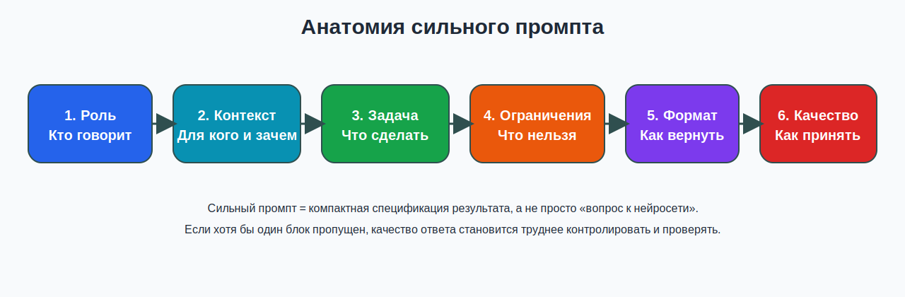
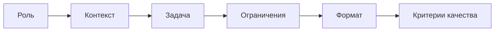

# 01. Конструирование промпта: как получить управляемый результат от LLM

## Зачем эта тема
Студент уже знает, что существуют разные AI-инструменты и что они помогают педагогу в подготовке материалов. Следующий шаг - научиться управлять результатом.

Задача этой лекции - перейти от логики «спросить у модели что-нибудь полезное» к логике **«поставить задачу так, чтобы результат можно было проверить, доработать и использовать дальше»**.

## Базовые определения

**Промпт** - формализованная постановка задачи для модели.

**Контекст** - сведения о дисциплине, теме, аудитории, целевом результате и ограничениях.

**Формат ответа** - заранее заданный способ, в котором модель должна вернуть результат: список, таблица, JSON, письмо, rubric, чек-лист.

**Критерий качества** - признак, по которому мы понимаем, что ответ можно принять или нужно доработать.

**Итерация промпта** - целенаправленное изменение запроса после анализа дефекта результата.

## Почему слабый промпт ломает качество результата
- Модель не знает, для кого именно создается материал.
- Модель не понимает границу между черновиком и готовым продуктом.
- Модель пытается «угадать» формат, глубину и уровень сложности.
- Пользователь оценивает ответ по стилю, а не по проверяемым критериям.

## Анатомия сильного промпта



*Схема 1. Обязательные блоки сильного промпта*

### Mermaid-дубль схемы


## Шесть обязательных блоков
1. **Роль**: кем модель должна выступать в этой задаче.
2. **Контекст**: для какой дисциплины, темы и аудитории создается результат.
3. **Задача**: что именно нужно сделать.
4. **Ограничения**: что нельзя делать, что нельзя придумывать, какой объем допустим.
5. **Формат**: в каком виде вернуть ответ.
6. **Критерии качества**: по каким признакам ответ будет принят.

## Рабочая формула промпта
```text
Ты - [роль].

Контекст:
- дисциплина: ...
- тема: ...
- аудитория: ...
- цель: ...

Задача:
Сделай ...

Ограничения:
- не придумывай факты;
- не используй лишние персональные данные;
- соблюдай уровень подготовки аудитории;
- объем: ...

Формат ответа:
[таблица / JSON / письмо / список]

Критерии качества:
- ...
- ...
- ...
```

## Типовые паттерны для педагога

| Задача | Что задаем явно | Удобный формат |
|---|---|---|
| Фрагмент занятия | тема, цель, уровень группы, этап урока | таблица |
| Набор оценочных заданий | число заданий, тип заданий, критерии оценивания | JSON или таблица |
| Персонализированный feedback | уровень результата, сильные стороны, ошибки, следующий шаг | письмо или шаблон блоков |

## Свободный ответ и структурированный ответ

### Слабый запрос
```text
Сделай задания по информатике для студентов.
```

### Улучшенный запрос
```text
Ты - методист по информатике СПО.

Контекст:
- тема: ветвление в алгоритмах;
- аудитория: 1 курс СПО;
- цель: проверить различие между линейным и ветвящимся алгоритмами.

Задача:
Составь 4 задания: 2 базовых, 1 повышенное, 1 на объяснение ошибки.

Ограничения:
- не выходи за рамки темы;
- не используй термины без пояснения;
- не придумывай внешние источники;
- не используй реальные персональные данные.

Формат ответа:
Верни JSON со схемой:
{
  "tasks": [
    {
      "level": "",
      "question": "",
      "expected_answer": "",
      "criterion": ""
    }
  ]
}
```

## Few-shot: когда нужен пример
Few-shot полезен, когда результат должен повторять известный формат. Пользователь дает модели один короткий эталон и просит сделать новый результат по тому же образцу.

Few-shot особенно полезен для:
- критериев оценивания;
- feedback-писем;
- карточек заданий одного типа;
- таблиц с фиксированными колонками.

## Итеративная доработка промпта
Рабочая логика всегда циклическая:
1. Сформулировать первый промпт.
2. Получить результат.
3. Найти конкретный дефект.
4. Изменить только тот блок промпта, который связан с дефектом.
5. Снова проверить результат.

Если проблема связана с уровнем сложности, меняем **контекст и критерии качества**.

Если проблема связана с рыхлым ответом, меняем **формат и ограничения**.

Если проблема связана с выдуманными фактами, добавляем **запрет на домысливание** и требование работать только с данным источником.

## Что обычно ломает результат
- слишком общая постановка задачи;
- несколько несвязанных целей в одном запросе;
- отсутствие формата ответа;
- отсутствие критерия приемки;
- просьба «сделай хорошо» без измеримых признаков качества;
- передача модели лишних данных, которые не нужны для решения.

## Мини-чек-лист перед запуском
1. Понятно ли, для кого создается результат?
2. Ясно ли, что именно модель должна сделать?
3. Есть ли ограничения на факты, тон и объем?
4. Задан ли формат ответа?
5. Понятно ли, по каким признакам ответ будет принят?

## Практический смысл для темы 02
Если в теме 01 студент учился выбирать инструмент, то здесь он учится **конструировать задание для инструмента**.

Без этого шага нельзя переходить к надежной верификации и тем более к проектированию более сложных образовательных систем.

## Вывод
Сильный промпт - это не «хитрая фраза», а компактная проектная спецификация результата: кто делает, для кого, что именно, в каком формате и по каким правилам качества.
