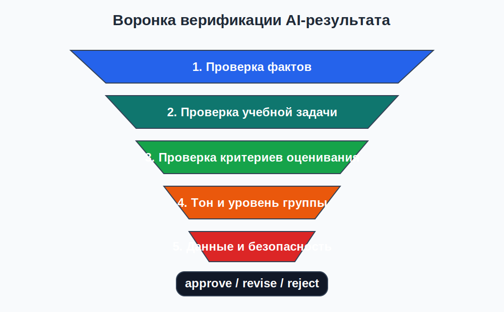
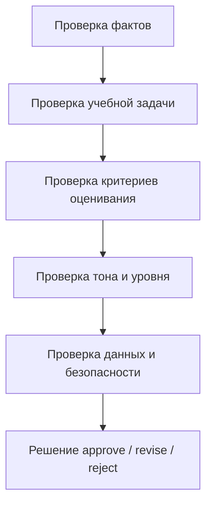

# 02. Верификация и quality gates: почему правдоподобный ответ не равен корректному

## Почему нужна отдельная проверка
LLM умеет писать гладко, уверенно и быстро. Именно поэтому риск ошибки становится менее заметным.

В учебной среде нельзя опираться только на впечатление от ответа. Нужно проверять:
- соответствует ли он источнику;
- соответствует ли он цели занятия;
- не искажает ли уровень сложности;
- не нарушает ли правила оценивания;
- можно ли его вообще показать студенту без доработки.

## Базовые определения

**Галлюцинация** - правдоподобное, но не подтвержденное содержимое.

**Quality gate** - точка проверки, после которой результат либо принимается, либо возвращается на доработку.

**Верификация** - проверка результата по заранее определенным вопросам и доказательствам.

**Решение `approve/revise/reject`** - финальный вывод по результату:
- `approve` - можно использовать без критических исправлений;
- `revise` - идея пригодна, но результат требует исправлений;
- `reject` - результат нельзя использовать как основу.

## Воронка проверки

*Схема 2. Проверка идет от базовой фактической корректности к решению о применимости*

### Mermaid-дубль схемы

## Пять слоев верификации

| Слой | Вопрос | Типовой дефект | Что делать |
|---|---|---|---|
| Факты | Соответствует ли результат источнику? | выдуманное определение, лишний тезис | сверить с исходным текстом, убрать домыслы |
| Учебная задача | Решает ли результат именно ту педагогическую задачу, которая была поставлена? | ответ красивый, но не помогает достичь цели | переформулировать задачу и критерии качества |
| Оценивание | Ясно ли, как будет проверяться результат? | критерии размыты или отсутствуют | добавить rubric, баллы, признаки правильного ответа |
| Тон и уровень | Соответствует ли результат возрасту и уровню группы? | сложный язык, лишняя терминология, менторский тон | упростить язык, ограничить термины, изменить стиль |
| Данные и безопасность | Нет ли лишних ПД, чувствительных формулировок, непрозрачных советов? | лишние имена, email, уверенные советы без основания | обезличить данные, переписать формулировки, убрать риск |

## Красные флаги
- в ответе появляются источники, которых пользователь не задавал;
- в ответе есть категоричные советы без признаков обоснования;
- критерии оценивания выглядят «убедительно», но не связаны с задачей;
- терминология явно не соответствует уровню группы;
- модель добавляет лишние персональные детали;
- результат нельзя проверить по исходному материалу.

## Источник истины в учебной задаче
В рамках темы 02 таким источником обычно является:
- опорный текст преподавателя;
- учебный фрагмент;
- локальная rubric;
- зафиксированная цель занятия.

Если ответ модели нельзя сопоставить хотя бы с одним из этих оснований, его нельзя принимать без доработки.

## Human-in-the-loop
В учебной среде человек не может быть убран из контура проверки.

Роль преподавателя или студента как проверяющего:
- сопоставить ответ с источником;
- обнаружить недоказуемые утверждения;
- проверить пригодность результата именно для данной группы;
- зафиксировать, почему ответ принят или возвращен на доработку.

## Пример принятия решения

### Ситуация
Модель сгенерировала 4 задания по теме «ветвление в алгоритмах».

### Найденные проблемы
- одно задание проверяет цикл, хотя тема про ветвление;
- в одном критерии оценки нет признаков правильного ответа;
- язык одного задания слишком сложен для 1 курса СПО.

### Решение
`revise`

### Почему не `reject`
Основная структура набора заданий полезна, но нужны точечные исправления.

## Таблица решения `approve/revise/reject`

| Статус | Когда ставится | Что происходит дальше |
|---|---|---|
| `approve` | нет критических дефектов, результат проверяем и безопасен | можно использовать в занятии или передавать дальше |
| `revise` | есть исправимые дефекты | промпт или результат дорабатывается, затем проверяется повторно |
| `reject` | результат не соответствует цели, источнику или требованиям безопасности | результат не используется; создается новый запрос или меняется подход |

## Три контрольных сценария
1. **Корректный текст**: все соответствует источнику, уровень уместен, ПД нет -> обычно `approve`.
2. **Фактическая ошибка**: ответ хорошо написан, но нарушает содержание темы -> минимум `revise`.
3. **Лишние персональные данные**: результат содержит реальные идентификаторы или ненужные персональные детали -> `revise` или `reject` в зависимости от тяжести нарушения.

## Мини-чек-лист перед публикацией результата
1. Подтверждаются ли все утверждения источником?
2. Работает ли результат именно на заявленную учебную цель?
3. Ясны ли критерии оценивания или признаки качества?
4. Подходит ли уровень языка и тона для аудитории?
5. Нет ли лишних данных и непрозрачных рекомендаций?

## Практический смысл для лабораторной 2
Лабораторная 2 не проверяет «насколько красиво ответила модель». Она проверяет, умеет ли студент:
- найти дефект;
- доказать, что это дефект;
- исправить или отклонить результат;
- зафиксировать решение в понятной форме.

## Вывод
Хороший AI-ответ не принимается «на глаз». Он проходит через последовательные quality gates, и только после этого может стать частью учебного материала, feedback или более сложной образовательной системы.
