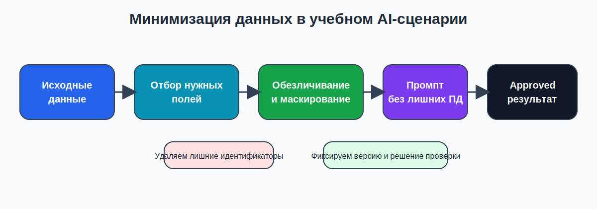
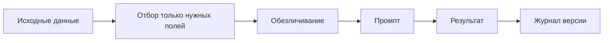

# 03. Безопасная работа с данными и прозрачность использования ИИ

## Почему это часть темы 02
Даже технически хороший результат нельзя использовать в учебной среде, если:
- в промпт переданы лишние персональные данные;
- обучающимся неясно, где работал ИИ, а где работал человек;
- итоговый материал нельзя защитить с точки зрения авторства и ответственности;
- не ведется учет утвержденных версий промптов и результатов.

Надежность AI-работы включает не только качество текста, но и **безопасность данных, прозрачность и управляемость процесса**.

## Базовый принцип
В модель передается только то, что необходимо для решения конкретной задачи.

Если задача решается без ФИО, email, номера группы или других идентификаторов, эти данные передавать нельзя.

## Точки минимизации данных



*Схема 3. Где именно происходит обезличивание в учебном сценарии*

### Mermaid-дубль схемы


## Что считается лишними данными
- реальные фамилии, если можно использовать `student_01`;
- реальный email, если нужна только логика ответа;
- служебные детали, не влияющие на учебную задачу;
- сведения, которые модель не должна использовать для оценивания или персонализации.

## Что допустимо передавать
- тема занятия;
- уровень группы;
- опорный учебный фрагмент;
- обезличенный профиль результата: `низкий`, `средний`, `высокий`;
- rubric, шаблон feedback, требования к формату.

## Когда предпочитать отечественные или локальные инструменты

| Сценарий | Предпочтительный класс инструмента | Почему |
|---|---|---|
| Учебный черновик без ПД | любой доступный инструмент | риск по данным минимален |
| Работа с чувствительными данными | отечественный или локальный инструмент | проще контролировать контур обработки |
| Эксперимент с format-only output | локальная модель или обезличенный ввод | можно тренировать структуру без реальных данных |
| Подготовка материала для массовой выдачи студентам | инструмент с понятной политикой использования и возможностью ручной проверки | важна предсказуемость и управляемость |

## Прозрачность использования ИИ
Обучающийся должен понимать:
- использовался ли ИИ при подготовке материала;
- кто несет ответственность за итоговую версию;
- что материал прошел человеческую проверку;
- где находится граница между AI-черновиком и утвержденным содержанием.

### Простая формула прозрачности
```text
Материал подготовлен с использованием ИИ как чернового инструмента.
Итоговая версия проверена и утверждена человеком.
```

## Авторство и плагиат
В рамках учебной практики допустимо:
- использовать ИИ для черновика;
- использовать ИИ для генерации вариантов формулировок;
- использовать ИИ для создания структуры таблицы, rubric или письма.

Недопустимо:
- выдавать сырой AI-ответ за полностью самостоятельную работу;
- использовать сгенерированный материал без проверки и правок;
- скрывать факт использования ИИ, если это влияет на оценку или содержание результата;
- переносить реальные персональные данные в AI-сервис без необходимости.

## Кто отвечает за итоговый результат
Ответственность за итоговую версию несет не модель, а человек, который:
- сформулировал задачу;
- выбрал входные данные;
- проверил ответ;
- принял решение о применимости результата.

## Лог версий: что фиксировать

| Артефакт | Что хранить | Зачем |
|---|---|---|
| Промпт | финальную формулировку и номер версии | чтобы можно было повторить результат |
| Итерация | найденный дефект и исправление | чтобы понимать, что именно улучшалось |
| Результат | утвержденную версию | чтобы не использовать случайный черновик |
| Решение проверки | `approve/revise/reject` и краткое основание | чтобы решение было объяснимым |

## Учебный чек-лист безопасного использования

| Вопрос | Да/нет |
|---|---|
| Переданы только необходимые данные? |  |
| Все примеры обезличены? |  |
| Понятно, что именно сделал ИИ, а что проверил человек? |  |
| Итоговая версия отличена от черновика? |  |
| Есть запись о версии промпта и решении проверки? |  |

## Типовые ошибки студентов
- «Для примера» вставляют реальные ФИО и email.
- Не сохраняют итоговый approved-вариант и потом не могут его воспроизвести.
- Считают, что если ответ звучит уверенно, его можно сразу отправлять студенту.
- Не указывают, что материал был создан с участием ИИ.

## Практический смысл для темы 03
Тема 03 будет требовать более сложной логики: шаблонов, автоматизации, журналирования и передачи результата дальше по цепочке.

Если в теме 02 не научиться минимизировать данные и фиксировать approved-версию, автоматизация в следующем модуле будет ненадежной.

## Вывод
Безопасная работа с ИИ - это не отдельное «юридическое приложение», а часть инженерной дисциплины: минимизируй данные, фиксируй версии, обозначай роль человека и не передавай в учебный процесс непроверенный черновик.
