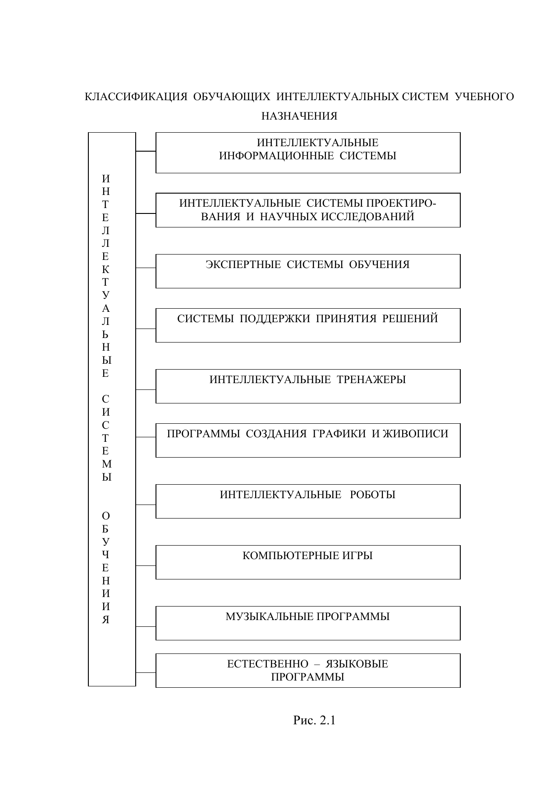
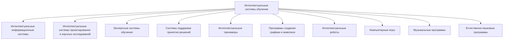
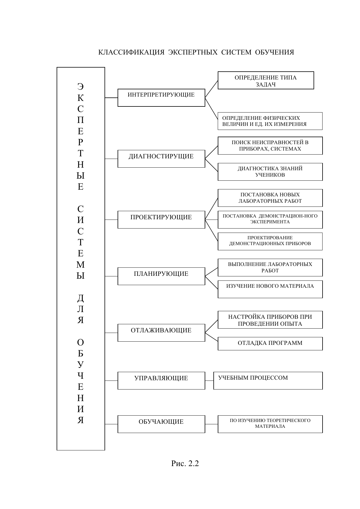
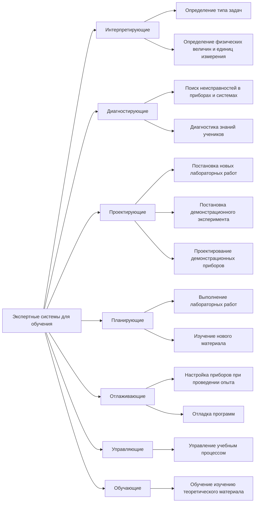

# 01. Контекст: интеллектуальные и экспертные системы обучения

## Зачем эта тема
Интеллектуальные системы обучения (ИСО) развивают идеи классических автоматизированных обучающих систем: делают обучение более адаптивным, учитывают состояние обучающегося, поддерживают принятие педагогических решений и помогают организовать обратную связь.

Внутри ИСО наиболее практически значимый класс для учебных задач - **экспертные системы обучения (ЭСО)**.

## Базовые определения

**Интеллектуальная обучающая система** - интеллектуальная система, применяемая для обучения человека деятельности или для поддержки обучения школьников/студентов.

**Экспертная система** - интеллектуальная система, предназначенная для оказания консультационной помощи специалистам в конкретной предметной области.

**Экспертная система обучения (ЭСО)** - экспертная система, примененная к задачам обучения: диагностике знаний, поддержке освоения материала, формированию рекомендаций и управлению учебными действиями.

## Ключевые характеристики экспертных систем (по Р. Форсайту)
1. Ограниченность конкретной сферой экспертизы.
2. Способность рассуждать при неполных/сомнительных данных.
3. Способность объяснять цепочку рассуждений.
4. Явное разделение фактов и механизма вывода.
5. Возможность постепенного наращивания системы.
6. Частая опора на правила вывода.
7. На выходе - квалифицированный совет, а не только «сырые цифры».
8. Экономическая целесообразность.

## Проектный подход к ЭСО
При разработке ЭСО важна **совмещенная (concurrent) проектная логика**:
- междисциплинарная интеграция (предметная область + педагогика + психология + информатика);
- параллельно-агрегатная разработка с учетом жизненного цикла уже на ранних этапах;
- управление проектной неопределенностью;
- готовность пересматривать ранние решения;
- постоянная оценка качества.

Дополнительный методологический тезис: науки об искусственных системах имеют проектную природу, поэтому ЭСО нужно вести как управляемый проект, а не как набор разрозненных технических действий.

## Методологический фокус: три модели, которые нельзя пропускать
В исходных материалах (включая тезисы 5-й Национальной конференции по ИИ) зафиксировано, что результативное проектирование ИСО опирается на одновременную разработку трех моделей:
- модели предметной области;
- модели обучаемого;
- модели эксперта-педагога (управление процессом обучения).

Если хотя бы одна из трех моделей не проработана, система теряет либо содержательную корректность, либо педагогическую применимость.

## Пути реализации совмещенного проектирования
1. **Междисциплинарные рабочие группы**: предметники, методисты, педагоги, психологи, специалисты по ИТ совместно принимают ранние проектные решения.
2. **Формальные методы интеграции знаний**: единые структуры понятий, правил и связей между педагогическими и предметными знаниями.
3. **Выбор проектных решений по многокритериальной оценке**: сравнение вариантов по смешанным качественно-количественным признакам, включая методы факторного анализа.

## Классификация обучающих интеллектуальных систем

*Рис. 2.1. Классификация обучающих интеллектуальных систем учебного назначения (из входных материалов)*

### Mermaid-дубль схемы (для удобства чтения)

## Классификация экспертных систем обучения

*Рис. 2.2. Классификация ЭСО по типу решаемых учебных задач (из входных материалов)*

### Mermaid-дубль схемы (для удобства чтения)

## Условия, когда создание ЭСО оправдано

### Условия возможности
- Есть эксперты-предметники.
- Эксперт готов к взаимодействию с разработчиками.
- Эксперт умеет вербализовать и объяснять свои действия.
- Учебная задача достаточно структурирована.
- Задача не чрезмерно сложная и не чрезмерно большая на старте.

### Условия эффективности
- Система усиливает познавательную активность.
- Развивает самостоятельное приобретение знаний.
- Интенсифицирует обучение.
- Поддерживает динамическую адаптацию.
- Улучшает диагностику знаний.
- Повышает качество массового обучения.
- Снижает рутинную нагрузку преподавателя.

## Вывод
ЭСО - это не, к примеру, «просто автоматическое тестирование», а проектируемая интеллектуальная система с явной моделью знаний, механизмом вывода и доказуемой полезностью для учебного процесса.
