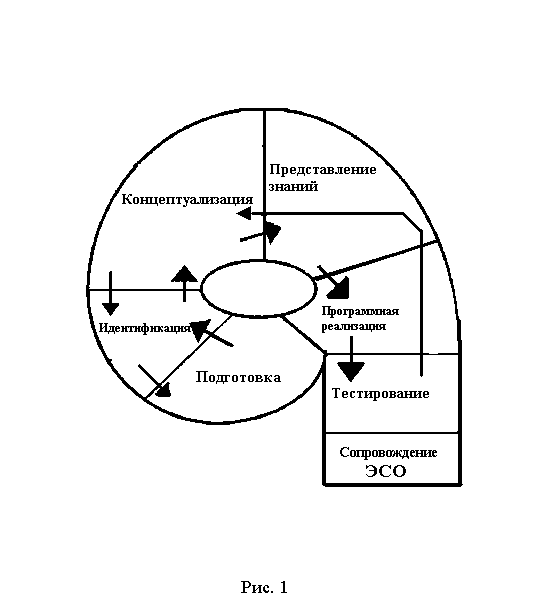
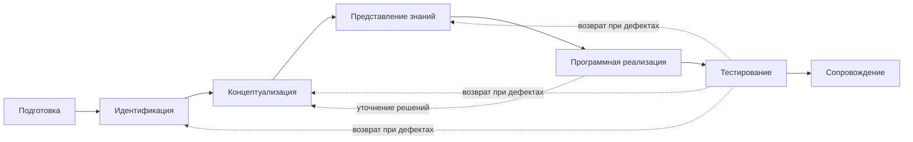

# 02. Жизненный цикл ЭСО: от идеи до сопровождения

## Циклическая модель разработки

*Рис. 1. Циклическая диаграмма жизненного цикла экспертной системы обучения (из входных материалов)*

### Mermaid-дубль схемы

## Пять взаимосвязанных проблем проектирования ЭСО
В исходных материалах жизненный цикл раскрывается через последовательное решение пяти взаимосвязанных проблем:
1. Выяснение условий возможности и эффективности создания ЭСО.
2. Построение модели задач по организации и управлению приобретением знаний.
3. Реализация модели управления обучением в архитектуре ЭС.
4. Разработка последовательности действий по приобретению знаний.
5. Подбор и обоснование методов приобретения знаний для формирования базы знаний.

### Соответствие проблем и фаз жизненного цикла
| Проблема | Где решается в цикле |
|---|---|
| 1. Возможность и эффективность | Фаза 1: Подготовка |
| 2-5. Моделирование, архитектура, действия, методы знаний | Фазы 2-4: Идентификация, Концептуализация, Представление знаний |

## Фазы и ожидаемые результаты

| Фаза | Смысл фазы | Результат фазы |
|---|---|---|
| Подготовка | Проверка возможности и целесообразности разработки ЭСО | Зафиксированы цель, контекст, ограничения и критерии успеха |
| Идентификация | Уточнение задач, ролей, данных, границ системы | Карта задач, ролей и входных/выходных данных |
| Концептуализация | Построение концептуальной модели управления обучением | Архитектура решения и модель учебного процесса |
| Представление знаний | Формализация знаний эксперта и правил вывода | База знаний/правил, объяснимые критерии решения |
| Программная реализация | Сборка прототипа и интеграция компонентов | Рабочий прототип с базовым сценарием |
| Тестирование | Проверка качества и полезности в учебном контексте | Отчет о тестах, дефектах, корректировках |
| Сопровождение | Адаптация системы к новым условиям применения | План улучшений, версионность, эксплуатационные регламенты |

Важно: **фазы 2-4 являются наиболее сложными**, потому что именно здесь эксперт и инженер по знаниям формируют ядро базы знаний и логику вывода системы.

## Почему это именно цикл, а не линейная цепочка
Процесс создания ЭСО немонотонен. После реализации и тестирования часто выявляются пробелы в знаниях, ошибочная детализация или неудобный механизм управления обучением. Тогда команда возвращается к предыдущим фазам и пересобирает решения.

## Логика прототипирования по фазам 5-6
Разработка ЭСО проходит несколько состояний прототипа:
1. **Демонстрационный прототип**: подтверждает корректность выбранных методов и представления знаний на ограниченном наборе подзадач.
2. **Исследовательский прототип**: расширенная версия после корректировок, с более развитым интерфейсом, цепочкой выводов и библиотекой учебных задач.
3. **Учебный прототип**: версия, успешно прошедшая неоднократное тестирование в реальном учебном процессе.

Именно переходы между этими состояниями обеспечивают инженерную зрелость системы перед сопровождением.

## Критерии оценки качества ЭСО (на фазе тестирования)
1. Совпадают ли решения ЭСО с решениями экспертов в моделируемой учебной ситуации.
2. Корректны ли правила вывода: безошибочность, непротиворечивость, полнота.
3. Соответствуют ли предлагаемые системой учебные действия действиям эксперта.
4. Дает ли система адекватное объяснение принятым решениям.
5. Достаточно ли полна и многовариантна база знаний.

## Критерии оценки полезности ЭСО
1. Помогает ли система качественно приобретать знания и развивать познавательные способности.
2. Улучшает ли организацию самостоятельной работы обучающихся.
3. Корректно ли методически оформлены рекомендации системы.
4. Удовлетворяет ли форма и объем выдаваемого решения.
5. Есть ли динамическая адаптация к пользователю.
6. Достаточно ли дружественный интерфейс.

## Типовые дефекты, выявляемые на тестировании
- Отсутствуют нужные учебные понятия и отношения.
- Неправильный уровень детализации знаний.
- Недостаточная детализация учебных целей, действий и управляющих воздействий.
- Неудобный механизм управления обучением.

## Практический смысл для студентов
При проектировании любой образовательной системы важно не «рисовать красивую схему», а доказать:
- почему система нужна;
- как представлены знания и правила;
- как система тестируется;
- как она будет сопровождаться после первого запуска.

## Вывод
Жизненный цикл ЭСО - это рабочий механизм управления качеством проекта: каждая фаза производит проверяемый результат, а возвраты между фазами являются нормой инженерной разработки.
