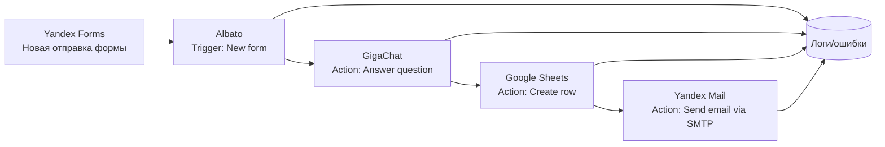

# 03. Практический стек интеграции: Albato + Яндекс Формы + GigaChat + Google Sheets + Яндекс Почта

## Целевой сценарий для трека A
`Yandex Forms (quiz) -> Albato trigger (New form) -> GigaChat action -> Google Sheets action -> Yandex Mail action`

## Роли сервисов

| Сервис | Роль в решении | Что передает дальше |
|---|---|---|
| Яндекс Формы | Сбор ответов обучающегося | Сырые ответы, email, служебные поля формы |
| Albato | Оркестрация сценария и маппинг полей | Нормализованные данные между шагами |
| GigaChat | Генерация персонализированного feedback | Оценка + объяснение + рекомендация |
| Google Sheets | Журнал результатов и аналитика | Структурированные записи для преподавателя |
| Яндекс Почта | Доставка feedback студенту | Персональное письмо по шаблону |

## Архитектура потока данных

## Инженерные ограничения и практические выводы

### 1) Ограничения на уровне коннекторов Albato
- На странице приложения **Yandex Forms** в Albato указано: `Triggers 1`, `Actions 0`.
- На странице **GigaChat**: `Triggers 0`, `Actions 4`.
- На странице **Yandex Mail**: `Triggers 0`, `Actions 1`.
- На странице **Google Sheets**: `Triggers 11`, `Actions 12`.

**Вывод (инференс из источников):** в учебном сценарии Yandex Forms используется как **источник события**, а все изменения/действия выполняются через другие приложения в цепочке.

### 2) Ограничения GigaChat API
- Авторизация выполняется через отдельный OAuth endpoint (`/api/v2/oauth`).
- Ограничения API при перегрузке возвращают `HTTP 429 Too Many Requests`.
- Модель нужно выбирать осознанно под учебный кейс (стоимость/скорость/качество).

Практическое правило: закладывать ретраи и fallback-текст feedback при ошибках модели.

### 3) Ограничения Google Sheets API
По официальной документации Google Sheets API есть квоты на операции чтения/записи (на проект и на пользователя).

Практическое правило: в учебной цепочке писать в таблицу **одну агрегированную запись на попытку**, а не несколько мелких запросов подряд.

### 4) Ограничения Яндекс Форм и Яндекс Почты
- В Яндекс Формах доступен режим тестирования и механика уведомлений/переменных в почтовых сценариях.
- Для SMTP Яндекс 360 используется сервер `smtp.yandex.com` (порт SSL 465).

Практическое правило: заранее проверять доставку письма на тестовый адрес и валидность переменных в шаблоне.

## Минимальные правила надежности для студенческого проекта
1. Проверять пустые/некорректные ответы из формы до вызова LLM.
2. Логировать каждый запуск сценария (ID попытки + статус шагов).
3. Защищаться от дубликатов событий (idempotency key: `form_response_id`).
4. Не отправлять письмо, если шаг оценки невалиден.
5. Всегда сохранять запись в Google Sheets даже при частичной ошибке цепочки.

## Дополнительные релевантные источники (официальные)
Проверено: **10.03.2026**.

### Albato
- https://albato.com/apps/yandexforms
- https://albato.com/apps/gigachat
- https://albato.com/apps/googlesheets
- https://albato.com/apps/yandexmail
- https://wiki.albato.com/en/articles/9573596-google-sheets

### Яндекс Формы и Яндекс Почта
- https://yandex.ru/support/forms/ru/overview
- https://yandex.ru/support/forms/ru/tests
- https://yandex.ru/support/forms/ru/notifications
- https://yandex.ru/support/forms/ru/send-request
- https://yandex.ru/support/forms/ru/send-mail
- https://yandex.ru/support/forms/ru/vars
- https://yandex.com/support/yandex-360/customers/mail/en/mail-clients/others

### GigaChat API (Сбер)
- https://developers.sber.ru/docs/ru/gigachat/api/reference/rest/gigachat-api
- https://developers.sber.ru/docs/ru/gigachat/api/reference/rest/post-token
- https://developers.sber.ru/docs/ru/gigachat/limitations
- https://developers.sber.ru/docs/ru/gigachat/models/main
- https://developers.sber.ru/docs/ru/gigachat/tariffs/individual-tariffs

### Google
- https://support.google.com/docs/answer/2917686?hl=en
- https://developers.google.com/workspace/sheets/api/limits
