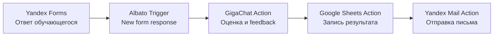

# 04. Практика - трек A: интеллектуальная система автотестирования обучающихся

## Формат
Индивидуальное задание. Каждый студент проектирует и описывает собственное решение по циклу ЭСО.

> `A-core` - основной зачетный контур. Выполнение трека A в полном объеме обязательно.

## Задача
Спроектировать систему, которая:
- принимает ответы обучающегося из Яндекс Формы;
- анализирует результаты через GigaChat;
- сохраняет результат в Google Sheets;
- отправляет персональный feedback на Яндекс Почту.

Цепочка: `Yandex Forms -> Albato -> GigaChat -> Google Sheets -> Yandex Mail`.

## Обязательные артефакты результата
1. Схема интеграции (блок-схема компонентов и потоков).
2. Таблица прохождения всех фаз жизненного цикла.
3. Шаблон промпта для GigaChat.
4. Структура столбцов Google Sheets.
5. Шаблон feedback-письма студенту.
6. Минимум 2 тест-кейса.
7. Журнал замечаний эксперта/пользователей и список корректировок с возвратом к нужным фазам цикла.

## Чек-лист комплаенса РФ для учебного проекта (обязательно заполнить)
Чек-лист применяется как учебно-методическое требование в рамках задания и не заменяет юридическую консультацию.

| Требование | Как подтвердить в работе | Статус |
|---|---|---|
| Законность и целевой характер обработки ПД | Указать учебную цель обработки данных и связь с задачей трека A | `да/нет` |
| Минимизация ПД | Использовать только необходимые поля (`student_name`, `student_email`, `group`, ответы) без избыточных данных | `да/нет` |
| Правовое основание/согласие | Описать, на каком основании собираются ответы и email в учебной среде | `да/нет` |
| Ограничение доступа и базовые меры защиты | Зафиксировать, кто имеет доступ к таблице/интеграции/почте и как ограничен доступ | `да/нет` |
| Обезличивание в учебных примерах | Для демонстрации использовать тестовые или обезличенные записи | `да/нет` |
| Запрет лишней передачи ПД в LLM и логи | В промпт и логирование передавать только необходимый минимум | `да/нет` |
| Срок хранения и удаление | Зафиксировать правило хранения и очистки тестовых данных после учебного цикла | `да/нет` |

Минимум для допуска к защите: все пункты чек-листа отмечены как `да`.

## Фазовая матрица жизненного цикла (заполнить полностью)

| Фаза | Что нужно описать | Результат студента |
|---|---|---|
| Подготовка | Цель системы, целевая аудитория, риски, этика | Краткое обоснование, зачем система нужна и кому помогает |
| Идентификация | Роли (преподаватель/студент/система), входные данные, критерии успеха | Перечень ролей, источников данных и измеримых критериев |
| Концептуализация | Архитектура решения и поток данных | Диаграмма цепочки и описание маршрута данных |
| Представление знаний | Правила интерпретации результатов, шаблоны feedback | Формализованные правила и структура рекомендации |
| Программная реализация | Настройка шагов в Albato и параметров сервисов | Пошаговая конфигурация сценария |
| Тестирование | Тест-кейсы, дефекты, метрики качества/полезности, замечания пользователей разного уровня подготовки | Таблица тестов, замечаний и список найденных проблем |
| Сопровождение | Что обновлять при изменениях курса/теста | План улучшений и контроля версий |

## Рекомендуемая архитектура


## Пошаговая сборка интеграции (проектный минимум)
1. Создать Яндекс Форму в режиме теста.
2. Добавить поля: `student_name`, `student_email`, `group`, `answers_blob`, `score_raw` (если есть автооценка формы).
3. В Albato создать сценарий и подключить Yandex Forms как trigger.
4. Настроить шаг GigaChat: передавать контекст теста, ответы и ожидаемый формат результата.
5. Настроить шаг Google Sheets: записывать итог в одну строку.
6. Настроить шаг Yandex Mail: отправлять персональное письмо с итогом и рекомендациями.
7. Добавить проверку от дубликатов по `form_response_id`.

## Маппинг полей между сервисами (обязательный шаблон)

| Источник | Поле | Куда передается | Назначение |
|---|---|---|---|
| Yandex Forms | `student_name` | GigaChat prompt + Email body + Sheets | Персонализация |
| Yandex Forms | `student_email` | Yandex Mail `to` + Sheets | Доставка feedback |
| Yandex Forms | `group` | Sheets | Аналитика по группе |
| Yandex Forms | `answers_blob` | GigaChat prompt | Оценка качества ответа |
| Yandex Forms | `form_response_id` | Sheets + dedup check | Защита от дубликатов |
| GigaChat | `grade_level` | Sheets + Email | Итоговая оценка |
| GigaChat | `feedback_text` | Email + Sheets | Пояснение результата |
| GigaChat | `next_step` | Email + Sheets | Рекомендация по улучшению |

## Шаблон промпта для GigaChat
```text
Ты - ассистент преподавателя.
Твоя задача: оценить ответы обучающегося по критериям теста и дать корректный развивающий feedback.

Контекст дисциплины: {{course_name}}
Тема теста: {{topic_name}}
Критерии оценки: {{rubric}}
Ответы обучающегося: {{answers_blob}}

Верни результат строго в JSON:
{
  "grade_level": "A|B|C|D|E",
  "strengths": ["...", "..."],
  "mistakes": ["...", "..."],
  "feedback_text": "...",
  "next_step": "..."
}

Требования:
- Не придумывай факты, которых нет в ответах.
- Пиши в педагогически корректном стиле.
- Не используй персональные данные вне контекста задачи.
```

## Шаблон структуры Google Sheets

| Колонка | Содержимое |
|---|---|
| `timestamp` | Время обработки |
| `form_response_id` | Идентификатор попытки |
| `student_name` | ФИО или имя |
| `student_email` | Email |
| `group` | Группа |
| `topic_name` | Тема теста |
| `grade_level` | Итог от модели |
| `feedback_text` | Краткий feedback |
| `next_step` | Рекомендация |
| `delivery_status` | Статус отправки письма |
| `error_note` | Ошибка шага (если была) |

## Шаблон feedback-письма
```text
Тема: Результаты теста по теме «{{topic_name}}»

Здравствуйте, {{student_name}}!

Ваш результат: {{grade_level}}.

Сильные стороны:
{{strengths}}

Что нужно улучшить:
{{mistakes}}

Рекомендация на следующий шаг:
{{next_step}}

Комментарий преподавателя/системы:
{{feedback_text}}

С уважением,
Учебная система поддержки обучения
```

## Инженерные ограничения (обязательно отразить в работе)
- **Квоты API**: для Google Sheets учитывать лимиты обращений и избегать лишних запросов.
- **SMTP**: проверить корректность SMTP-настроек Яндекс Почты и доставку тестового письма.
- **Дубликаты событий**: учитывать повторные webhook/trigger события, не дублировать строки и письма.
- **Проверка ответа модели**: валидировать JSON/структуру ответа GigaChat перед записью и отправкой.

## Два обязательных тест-кейса

| Кейc | Вход | Ожидаемый результат |
|---|---|---|
| Корректный | Полный набор валидных ответов | Запись в Sheets + корректное письмо + статус `success` |
| Граничный/ошибочный | Неполные ответы или сбой LLM | Запись в Sheets со статусом ошибки + fallback-текст без падения сценария |

## Журнал замечаний и корректировок (обязательный шаблон)

| Источник замечания | Наблюдаемая проблема | Фаза, куда возвращаемся | Корректирующее действие | Статус |
|---|---|---|---|---|
| Эксперт/преподаватель | Неполные правила оценки | Представление знаний | Уточнить rubric и формат JSON-ответа модели | planned |
| Пользователь/студент | Неясный текст feedback | Концептуализация / Представление знаний | Переписать шаблон письма и критерии тона | planned |
| Тестировщик | Дубликаты записей в таблице | Программная реализация | Добавить dedup по `form_response_id` | planned |

Минимальное требование: не менее 3 записей в журнале, включая хотя бы одну запись от пользователя.

## Шаблон самооценки по фазам ЖЦ (заполняется перед сдачей)

| Фаза | Статус выполнения | Что получилось | Что доработать |
|---|---|---|---|
| Подготовка | `выполнено/частично/не выполнено` |  |  |
| Идентификация | `выполнено/частично/не выполнено` |  |  |
| Концептуализация | `выполнено/частично/не выполнено` |  |  |
| Представление знаний | `выполнено/частично/не выполнено` |  |  |
| Программная реализация | `выполнено/частично/не выполнено` |  |  |
| Тестирование | `выполнено/частично/не выполнено` |  |  |
| Сопровождение | `выполнено/частично/не выполнено` |  |  |

## Критерии зачета по треку A
Зачет ставится, если:
1. Пройдены все 7 фаз жизненного цикла.
2. Есть все 7 обязательных артефактов.
3. Есть минимум 2 тест-кейса и выводы по результатам.
4. Учтены инженерные ограничения и описан план сопровождения.
5. Заполнен журнал замечаний и корректировок с возвратом к фазам цикла.
6. Заполнен комплаенс-чеклист РФ без провалов по обязательным пунктам.

Иначе - доработка.

Нормативные источники РФ для заполнения чек-листа:
- https://www.consultant.ru/document/cons_doc_LAW_140174/
- https://www.consultant.ru/document/cons_doc_LAW_61801/
- https://www.consultant.ru/document/cons_doc_LAW_61798/
