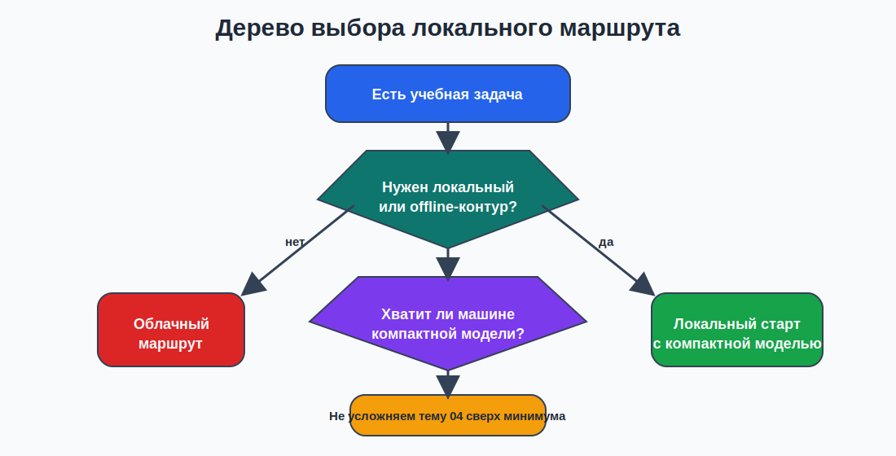
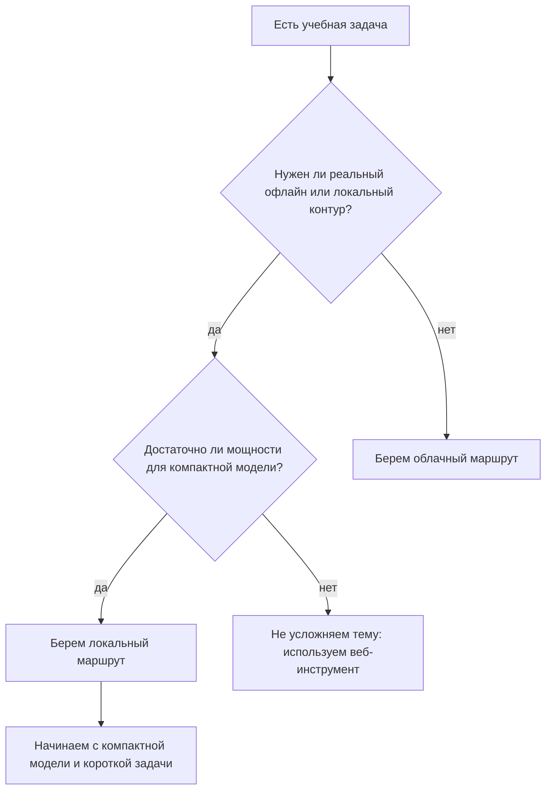

# 02. Зачем педагогу локальный ИИ-контур

## Зачем эта тема
Большинство студентов уже связывают ИИ с браузером, подпиской и облачным сервисом. Для базового педагогического курса этого недостаточно.

Будущему преподавателю информатики важно понимать, что существует и другой путь: **локальный контур**, в котором модель и рабочие файлы находятся на устройстве пользователя или в локальной сети учебной аудитории.

## Базовые определения

**Локальный ИИ-контур** - способ работы, при котором основная обработка выполняется на устройстве пользователя или в локальной среде, а не в удаленном облачном сервисе.

**Локальная LLM** - языковая модель, запущенная на компьютере пользователя через локальный рантайм.

**Локальная транскрибация** - распознавание речи без обязательной загрузки аудиофайла во внешний веб-сервис.

**Локальная работа с документом** - сценарий, в котором вопрос, источник и ответ остаются внутри локального приложения или локальной среды.

## Почему локальный маршрут вообще нужен
- в аудитории или дома может быть нестабильный интернет;
- не всегда удобно зависеть от подписок и лимитов веб-сервиса;
- учителю полезно показывать студентам воспроизводимый маршрут на своем устройстве;
- для части учебных материалов локальный запуск психологически и организационно проще контролировать;
- локальный контур помогает объяснить, что ИИ - это не только «чат в браузере», но и реальный программный стек.

## Сравнение локального и облачного контуров

| Критерий | Локальный контур | Облачный контур |
|---|---|---|
| Интернет | после установки часто можно работать офлайн | обычно нужен постоянный доступ |
| Данные | проще контролировать путь файла на своем устройстве | требуется дополнительная осторожность при передаче данных |
| Производительность | зависит от мощности локальной машины | зависит от удаленного сервиса и тарифа |
| Простота старта | первый запуск бывает сложнее | старт обычно проще |
| Воспроизводимость в аудитории | полезен для практикума по информатике | удобен для быстрого демонстрационного показа |

## Дерево выбора

*Схема 1. Как понять, нужен ли локальный маршрут в данной учебной задаче*

### Mermaid-дубль схемы

## Где локальный запуск оправдан в базовом курсе
1. Демонстрация реального запуска модели на устройстве преподавателя.
2. Создание чернового учебного материала без привязки к веб-сервису.
3. Локальная транскрибация короткого аудиофрагмента.
4. Простая работа с локальной раздаткой или коротким документом.
5. Показ студентам принципа: модель, рантайм, файл, результат, ограничения.

## Где локальный запуск не стоит навязывать
- если задача требует очень большой модели и длинного контекста;
- если устройство слишком слабое даже для компактного запуска;
- если преподавателю нужен быстрый результат прямо сейчас, а настройка локального контура займет больше времени;
- если учебная цель не связана с пониманием локальной инфраструктуры.

## Локальный контур и будущая работа преподавателя информатики
Для учителя информатики локальный маршрут полезен не только как инструмент, но и как **объект объяснения**.

Через него можно показать:
- что модель требует вычислительный ресурс;
- что качество зависит от размера модели и железа;
- что программный инструмент имеет ограничения;
- что один и тот же учебный запрос можно решать разными технологическими маршрутами.

## Пять принципов темы 04
1. Начинаем не с самой большой модели, а с самой воспроизводимой.
2. Сначала запускаем ядро - локальную LLM, потом добавляем прикладной сценарий.
3. Сохраняем доказательства реального запуска.
4. Не смешиваем тему локального ИИ с продвинутой инфраструктурой.
5. Всегда фиксируем ограничения результата.

## Практический смысл для студентов
В рамках темы 04 локальный ИИ - это не «магия на домашнем ноутбуке», а понятный базовый технологический контур:
- установить;
- запустить;
- получить результат;
- оценить ограничения;
- решить, пригоден ли он для учебной задачи.

## Вывод
Локальный ИИ-контур нужен педагогу не вместо облачных сервисов, а как еще один базовый профессиональный маршрут: более управляемый, более наглядный и полезный для учебной практики по информатике.
