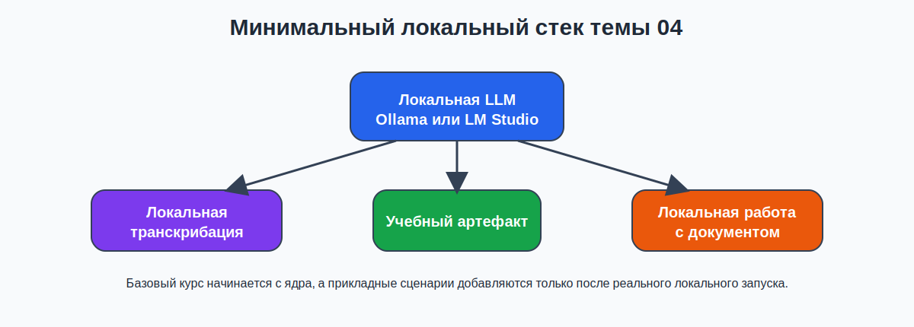
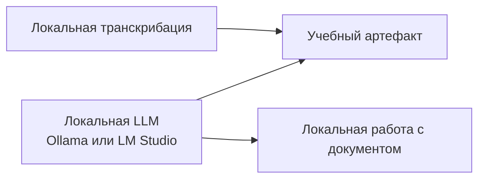

# 03. Минимальный локальный стек: что действительно нужно для базового курса

## Почему именно минимальный стек
В базовом курсе важно не количество инструментов, а воспроизводимость.

Если студенту сразу дать длинный список локальных решений, тема превратится в каталог и перегрузит занятие. Поэтому в теме 04 используется **минимальный стек**:
- локальная LLM как ядро;
- локальная транскрибация как прикладной сценарий;
- простая локальная работа с документом как второй прикладной сценарий.

## Схема минимального стека



*Схема 2. Базовый стек для темы 04*

### Mermaid-дубль схемы


## Ядро темы: локальная LLM

### Рекомендуемый маршрут 1: `Ollama`
`Ollama` подходит как CPU-first и терминальный маршрут, особенно для Linux и для тех студентов, кому удобен CLI.

Что важно для базового курса:
- локальный запуск после установки;
- простая проверка версии;
- явный запуск модели через командную строку;
- локальный API на `localhost`.

Минимальный маршрут:
```bash
# Linux
curl -fsSL https://ollama.com/install.sh | sh

# проверка
ollama -v

# если сервис не стартовал автоматически, запустите его
ollama serve
```

Если сервис уже работает, запускайте модель напрямую:
```bash
ollama run llama3.2
```

Если `ollama serve` запущен вручную, команду `ollama run llama3.2` удобнее выполнять во втором окне терминала.

Практическое правило темы 04: если не знаете, что выбрать, берите **компактную instruct-модель** и короткую учебную задачу.

### Рекомендуемый маршрут 2: `LM Studio`
`LM Studio` подходит как **основной GUI-first маршрут**, особенно если студенту легче работать через приложение, а не через терминал.

Что важно для базового курса:
- сначала запускается приложение;
- затем локальная модель скачивается и загружается в приложении;
- после загрузки модели приложение умеет работать офлайн;
- документы можно прикреплять локально;
- CLI `lms` есть, но в теме 04 он остается дополнительным маршрутом.

Безопасный маршрут по умолчанию:
1. Откройте `LM Studio`.
2. Выберите компактную instruct-модель.
3. Дождитесь загрузки модели в приложении.
4. Работайте через локальный чат в GUI.

Дополнительный CLI-маршрут для тех, у кого он уже готов:
```bash
lms --help
lms status
```

Важно: если `LM Studio` и модель еще не готовы, не нужно чинить терминальный маршрут любой ценой. Для темы 04 достаточно GUI-маршрута.

## Что делать на слабой машине
- не гнаться за большой моделью;
- брать короткий запрос и компактный учебный артефакт;
- не запускать сразу несколько тяжелых задач подряд;
- фиксировать наблюдаемые ограничения как часть результата, а не как «неудачу».

## Прикладной сценарий 1: локальная транскрибация

### Рекомендуемый путь: `faster-whisper`
Это удобный Python-маршрут для студентов, у которых уже есть базовая среда разработки.

Установка:
```bash
pip install faster-whisper
```

Минимальный пример:
```python
from faster_whisper import WhisperModel

model = WhisperModel("small", device="cpu", compute_type="int8")
segments, info = model.transcribe("audio.mp3", beam_size=5)

print(info.language, info.language_probability)
for segment in segments:
    print(segment.text)
```

Практическое правило: для темы 04 достаточно **короткого аудиофрагмента**, CPU-запуска и базовой проверки качества транскрипта.

### Альтернативный путь: `whisper.cpp`
Подходит тем, кто предпочитает чистый локальный CLI и CPU-маршрут.

Короткий маршрут:
```bash
git clone https://github.com/ggml-org/whisper.cpp.git
cd whisper.cpp
sh ./models/download-ggml-model.sh base.en
cmake -B build
cmake --build build -j --config Release
./build/bin/whisper-cli -f samples/jfk.wav
```

Если исходный файл не в `wav`, его нужно предварительно привести к удобному формату.

## Прикладной сценарий 2: локальная работа с документом
В базовом курсе не нужен отдельный продвинутый модуль по RAG. Для темы 04 достаточно **одного понятного GUI-first маршрута**:
- взять короткую локальную раздатку, `txt` или небольшой `pdf`;
- открыть документ в чате `LM Studio`;
- задать 3 вопроса, которые можно проверить по источнику;
- обязательно задать 1 вопрос, на который источник не отвечает;
- вручную отметить, где ответ поддержан источником, а где нет.

### Удобный путь через `LM Studio`
`LM Studio` позволяет прикреплять документы к локальному чату и работать с ними офлайн. Для новичка это основной маршрут документного сценария в теме 04.

Базовый порядок действий:
1. Открыть `LM Studio` с уже загруженной компактной instruct-моделью.
2. Создать новый чат.
3. Прикрепить короткий `.pdf` или `.txt`.
4. Вставить стартовую инструкцию:

```text
Отвечай только по прикрепленному источнику. Если в источнике нет данных, так и напиши: "Недостаточно данных в источнике".
```

5. Задать 3 проверяемых вопроса по документу.
6. Для каждого ответа сохранить evidence: страницу, цитату, заголовок или фрагмент текста.
7. Задать 1 вопрос, на который документ не отвечает, и зафиксировать границу модели.

### Дополнительный терминальный путь через `lms chat`
```bash
cat handout.txt | lms chat -p "Ответь только по этому источнику и отметь, если данных недостаточно."
```

Этот вариант допустим только если `LM Studio` уже запущен и локальная модель уже готова. Для базового курса он не является рабочим маршрутом для новичка и остается только справкой.

Для Windows в PowerShell можно использовать эквивалентный маршрут через `Get-Content`.

## Что не входит в обязательный минимум
- локальные image-generation pipeline;
- Docker и контейнерные маршруты;
- self-hosted серверы и продвинутые local API;
- большие document workflow с настройкой чанкинга и retrieval.

## Короткая таблица выбора маршрута

| Задача | Базовый инструмент | Почему |
|---|---|---|
| Запустить локальную модель | `Ollama` или `LM Studio` | это ядро темы |
| Получить учебный текст | та же локальная LLM | не нужен отдельный сервис |
| Расшифровать короткое аудио | `faster-whisper` или `whisper.cpp` | воспроизводимый offline-маршрут |
| Задать вопросы к раздатке | `LM Studio` GUI | локальный документный сценарий без усложнения и без CLI |

## Официальные источники по инструментам
Проверено: **24.03.2026**.

### `Ollama`
- https://docs.ollama.com/quickstart
- https://docs.ollama.com/linux
- https://docs.ollama.com/windows
- https://docs.ollama.com/api/introduction

### `LM Studio`
- https://lmstudio.ai/docs/
- https://lmstudio.ai/docs/app/offline
- https://lmstudio.ai/docs/app/basics/rag
- https://lmstudio.ai/docs/cli/
- https://lmstudio.ai/docs/cli/local-models/chat

### Локальная транскрибация
- https://github.com/ggml-org/whisper.cpp
- https://github.com/SYSTRAN/faster-whisper

## Вывод
Минимальный локальный стек для базового курса - это не “все, что существует на GitHub”, а короткий набор рабочих маршрутов, который реально можно поднять в учебной аудитории и применить к простой педагогической задаче.
