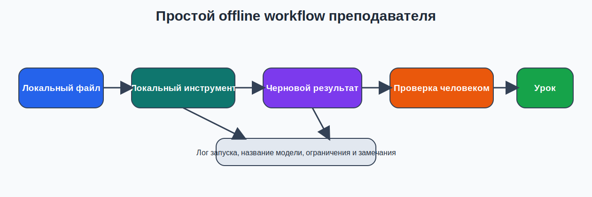
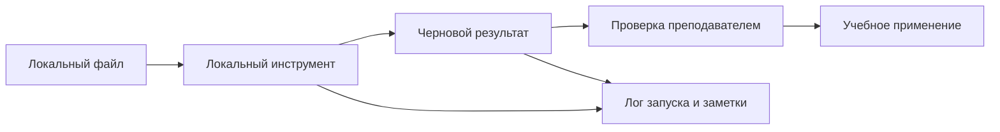

# 04. Безопасная и реалистичная работа с локальным ИИ

## Почему локально не значит автоматически безопасно
Студенты часто делают неверный вывод: если инструмент работает на своем устройстве, значит все проблемы безопасности и качества уже решены.

Это не так.

Локальный контур снижает часть рисков, но не отменяет:
- небрежное хранение файлов;
- смешивание личных и учебных данных;
- выбор неподходящей модели;
- переоценку качества локального ответа;
- отсутствие контроля версии инструмента и модели.

## Базовый принцип
Локально хранится только то, что действительно нужно для учебной задачи, и в понятной структуре папок.

## Простейшая структура папок для темы 04
```text
local-ai-lab/
├── inputs/
│   ├── handout.txt
│   └── audio.mp3
├── outputs/
│   ├── artifact.md
│   ├── transcript_raw.txt
│   └── transcript_fixed.txt
└── notes/
    └── run_log.md
```

## Где чаще всего ломается безопасная практика
- в папку с учебными файлами попадают реальные личные документы;
- сохраняется только финальный результат, а исходный лог запуска теряется;
- модель скачана случайно, без фиксации названия и версии;
- студенты не различают локальный файл, локальный рантайм и внешний веб-ресурс.

## Offline workflow преподавателя



*Схема 3. Простой локальный workflow от входного файла до проверенного результата*

### Mermaid-дубль схемы


## Как выбирать модель под машину

| Тип машины | Рекомендуемый подход | Что делать на практике |
|---|---|---|
| Слабая | компактная модель и короткие задачи | один небольшой учебный артефакт, без длинных документов |
| Средняя | компактная или средняя модель | можно делать `A-core` и один прикладной сценарий |
| Более сильная | расширенный эксперимент | можно тестировать более длинный документ или дополнительные режимы, но это не обязательно |

Важно: в теме 04 не оценивается «самая большая модель». Оценивается **реальный, воспроизводимый и честно описанный результат**.

## Ограничения локальных моделей, которые нужно признавать
- ответ может быть слабее, чем у облачной большой модели;
- маленькая модель быстрее ошибается на сложных объяснениях;
- длинные документы и длинные диалоги могут упираться в контекст;
- локальная транскрибация тоже делает ошибки и требует ручной правки;
- один и тот же инструмент по-разному ведет себя на разных машинах.

## Мини-чек-лист безопасного локального использования

| Вопрос | Да/нет |
|---|---|
| Все файлы для лабораторной лежат в отдельной учебной папке? |  |
| В работе нет лишних персональных данных? |  |
| Зафиксировано, какой инструмент и какая модель использовались? |  |
| Сохранен лог запуска или скриншот? |  |
| Ограничения результата честно описаны? |  |

## Версия инструмента и воспроизводимость
Для базовой инженерной культуры студент должен фиксировать:
- название инструмента;
- название модели;
- устройство и ОС;
- время запуска или ожидания;
- наблюдаемые ограничения.

Это особенно важно в локальном контуре, потому что одна и та же задача на двух разных машинах может вести себя по-разному.

## Что не стоит делать
- ставить сразу несколько тяжелых инструментов “на всякий случай”;
- скачивать модели без понимания, потянет ли их машина;
- хранить в учебной папке реальные студенческие персональные данные;
- утверждать, что локальный результат «точный», не проверив его;
- превращать базовую тему в соревнование по железу.

## Поддержка локального контура преподавателя
Преподавателю полезно иметь один собственный минимальный рабочий набор:
- один проверенный локальный маршрут `Ollama` или `LM Studio`;
- одну компактную модель для показа;
- один короткий аудиофрагмент;
- одну локальную раздатку для документного сценария;
- шаблон run log.

Такой набор снижает зависимость от случайных сбоев в аудитории.

## Практический смысл для студентов
Будущему преподавателю информатики важно не просто “запустить ИИ”, а показать учебно корректную цифровую культуру:
- отдельная папка проекта;
- понятный вход и выход;
- фиксация маршрута;
- честная оценка ограничений;
- безопасная работа с данными.

## Вывод
Хорошая локальная практика строится не вокруг идеи “все теперь офлайн”, а вокруг дисциплины: отделяй файлы, выбирай посильный инструмент, фиксируй маршрут и не скрывай ограничения результата.
